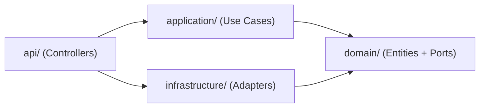
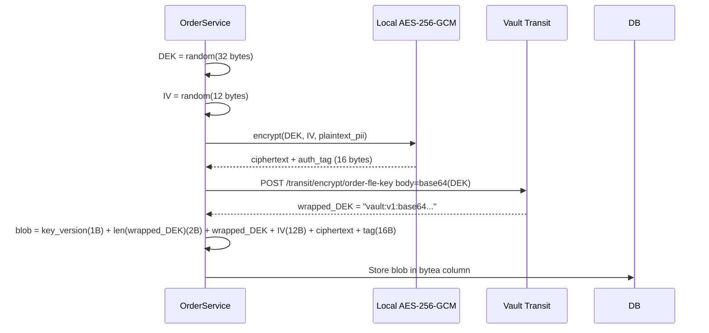
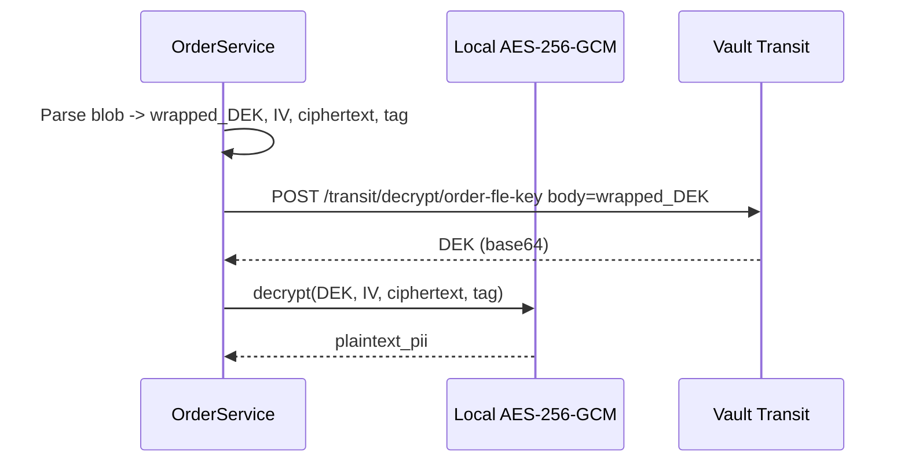
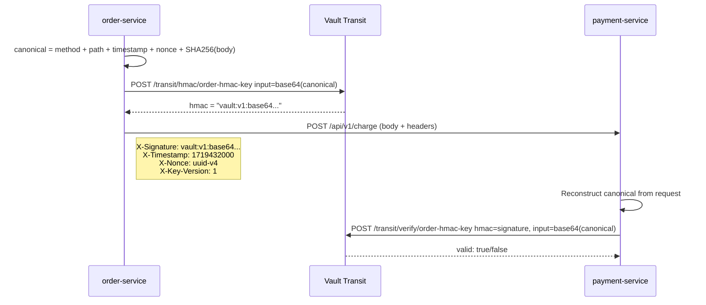
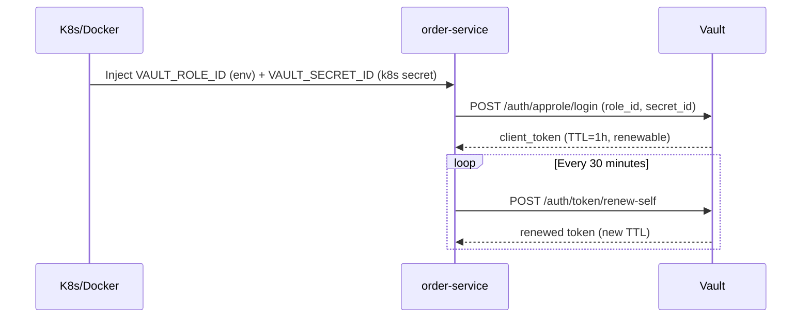

# Order Service -- Security Architecture & Cryptographic Design

## 1. Assessment: Current State vs Target

The current codebase has foundational elements but critical security gaps:

| Concern | Current State | Target |
|---|---|---|

- **Encryption**: `_encrypt_placeholder()` in [crud/order.py](services/order-service/app/crud/order.py) just does `.encode("utf-8")` -- **no actual encryption**
- **Vault**: Infrastructure exists ([init-vault.sh](infra/vault/scripts/init-vault.sh) creates keys and policies) but **no service-level integration**
- **Kafka**: **Not integrated** at all -- no producer, no consumer, no signed events
- **HMAC**: **Not implemented** -- inter-service calls have no integrity protection
- **Audit Logs**: DB schema defined in [03_order.dbml](docs/enmerce-db-schema/dbml/03_order.dbml) but **not implemented in code**
- **Saga**: `SagaState` model exists but **orchestration logic is a stub**
- **Anti-replay**: Basic idempotency key exists, but no nonce/timestamp window enforcement

---

## 2. Clean Architecture -- Target Directory Structure

The key principle: **dependencies point inward**. `domain/` has zero imports from `infrastructure/`. All external concerns (Vault, Kafka, PostgreSQL) live behind abstract ports.

```
services/order-service/
├── app/
│   ├── main.py
│   │
│   ├── domain/                          # CORE -- zero external dependencies
│   │   ├── entities/
│   │   │   ├── order.py                 # Order aggregate root + business rules
│   │   │   ├── order_item.py
│   │   │   └── saga.py                  # Saga state machine + transitions
│   │   ├── value_objects/
│   │   │   ├── money.py                 # Immutable Decimal wrapper
│   │   │   ├── order_status.py          # Status enum + valid transition map
│   │   │   └── encrypted_field.py       # Typed wrapper for encrypted bytes
│   │   ├── events/
│   │   │   ├── base.py                  # DomainEvent base (event_id, timestamp, aggregate_id)
│   │   │   ├── order_created.py
│   │   │   ├── order_status_changed.py
│   │   │   └── payment_requested.py
│   │   └── ports/                       # Abstract interfaces (ABCs)
│   │       ├── order_repository.py      # OrderRepository ABC
│   │       ├── event_publisher.py       # EventPublisher ABC
│   │       ├── crypto_service.py        # CryptoService ABC (encrypt/decrypt/sign/hmac)
│   │       ├── payment_gateway.py       # PaymentGateway ABC
│   │       └── audit_logger.py          # AuditLogger ABC
│   │
│   ├── application/                     # USE CASES -- orchestrates domain
│   │   ├── use_cases/
│   │   │   ├── checkout.py              # CheckoutUseCase (main entry)
│   │   │   ├── cancel_order.py
│   │   │   └── get_order.py
│   │   ├── saga/
│   │   │   ├── orchestrator.py          # CheckoutSagaOrchestrator
│   │   │   ├── steps/
│   │   │   │   ├── reserve_inventory.py
│   │   │   │   ├── fraud_check.py
│   │   │   │   ├── process_payment.py
│   │   │   │   └── confirm_order.py
│   │   │   └── compensations/
│   │   │       ├── release_inventory.py
│   │   │       └── refund_payment.py
│   │   └── dto/
│   │       └── checkout_dto.py          # Input/Output DTOs for use cases
│   │
│   ├── infrastructure/                  # ADAPTERS -- implements ports
│   │   ├── crypto/
│   │   │   ├── vault_client.py          # Vault connection, token lifecycle, caching
│   │   │   ├── vault_transit.py         # Vault Transit API wrapper
│   │   │   ├── envelope_encryption.py   # AES-256-GCM envelope encryption
│   │   │   ├── hmac_signer.py           # HMAC-SHA256 request signing
│   │   │   ├── digital_signature.py     # ECDSA P-256 event signing
│   │   │   └── vault_crypto_service.py  # Implements CryptoService port
│   │   ├── persistence/
│   │   │   ├── database.py
│   │   │   ├── models/                  # SQLAlchemy ORM models (unchanged)
│   │   │   │   ├── base.py
│   │   │   │   ├── order_model.py
│   │   │   │   ├── order_address_model.py
│   │   │   │   ├── order_item_model.py
│   │   │   │   ├── order_status_history_model.py
│   │   │   │   ├── saga_state_model.py
│   │   │   │   └── audit_log_model.py   # NEW: order_audit_log table
│   │   │   └── repositories/
│   │   │       └── pg_order_repository.py  # Implements OrderRepository
│   │   ├── messaging/
│   │   │   ├── kafka_producer.py        # Signed event producer
│   │   │   ├── kafka_consumer.py        # Event consumer + signature verify
│   │   │   └── event_schemas.py         # Kafka event envelope schema
│   │   ├── external/
│   │   │   └── payment_client.py        # mTLS + HMAC HTTP client
│   │   ├── cache/
│   │   │   └── redis_nonce_store.py     # Redis SET NX EX for anti-replay nonces
│   │   └── audit/
│   │       └── kafka_audit_logger.py    # Implements AuditLogger port
│   │
│   ├── api/                             # PRESENTATION -- HTTP layer
│   │   ├── dependencies.py              # FastAPI DI (auth, DB, crypto injection)
│   │   ├── middleware/
│   │   │   ├── hmac_verification.py     # Verify inbound HMAC from other services
│   │   │   └── nonce_guard.py           # Anti-replay: nonce + timestamp window
│   │   └── v1/
│   │       ├── router.py
│   │       └── user/
│   │           └── order.py
│   │
│   ├── core/                            # CROSS-CUTTING
│   │   ├── config.py                    # Pydantic Settings + Vault config
│   │   └── exceptions.py
│   │
│   └── schemas/                         # Pydantic request/response
│       ├── order.py
│       └── response.py
│
├── tests/
├── requirements.txt
├── Dockerfile
└── .env.example
```

**Dependency flow (inward only):**



`domain/` never imports from `infrastructure/`, `application/`, or `api/`. This ensures cryptographic implementations can be swapped (e.g., from Vault to AWS KMS) without touching business logic.

---

## 3. Cryptographic Design: Envelope Encryption (Field-Level Encryption)

**Goal**: Encrypt PII fields (`full_name`, `phone`, `email`, `address_line1`) before they reach PostgreSQL. Even a full DB dump reveals nothing without Vault access.

**Algorithms:**
- **KEK (Key Encryption Key)**: `order-fle-key`, type `aes256-gcm96`, managed by Vault Transit. Service never sees the raw KEK.
- **DEK (Data Encryption Key)**: 256-bit, randomly generated locally per encryption operation.
- **Data cipher**: AES-256-GCM (authenticated encryption with associated data). Provides confidentiality + integrity + authentication in one primitive.

**Why this combination?**
- GCM mode produces a 16-byte authentication tag -- tamper detection is built-in (kieu nhu: neu ai do sua ciphertext trong DB, decrypt se fail vi tag khong khop).
- DEK is generated locally, so plaintext PII never travels to Vault -- chi co DEK (32 bytes) duoc gui di de wrap/unwrap. Giam tai cho Vault drastically.

### 3.1 Encryption Flow



**Binary blob format** (stored in `LargeBinary` columns):

```
[version: 1 byte][wrapped_DEK_len: 2 bytes BE][wrapped_DEK: N bytes][IV: 12 bytes][ciphertext: variable][auth_tag: 16 bytes]
```

- `version` = `0x01` -- protocol version, cho phep upgrade format sau nay.
- `wrapped_DEK_len` = big-endian uint16 -- vi wrapped_DEK length thay doi theo Vault key version.
- Tong overhead ~= 1 + 2 + ~150 (wrapped_DEK) + 12 + 16 = ~181 bytes per field.

### 3.2 Decryption Flow



### 3.3 Key Rotation (Zero-downtime)

Vault Transit supports versioned keys. When you rotate `order-fle-key`:
1. New writes use the latest key version automatically.
2. Old blobs still decrypt because Vault keeps all key versions.
3. Background job calls `POST /transit/rewrap/order-fle-key` to re-encrypt `wrapped_DEK` with the new version -- **data itself is NOT re-encrypted**, chi co DEK duoc re-wrap. Extremely efficient.

### 3.4 Implementation Pseudocode

```python
# infrastructure/crypto/envelope_encryption.py

class EnvelopeEncryptor:
    BLOB_VERSION = 0x01

    def __init__(self, vault_transit: VaultTransit, key_name: str = "order-fle-key"):
        self._transit = vault_transit
        self._key_name = key_name

    async def encrypt(self, plaintext: str) -> bytes:
        dek = os.urandom(32)                         # AES-256
        iv = os.urandom(12)                          # GCM nonce
        cipher = AESGCM(dek)
        ciphertext_with_tag = cipher.encrypt(iv, plaintext.encode(), None)
        # ciphertext_with_tag = ciphertext || tag (last 16 bytes)

        wrapped_dek = await self._transit.encrypt(
            key_name=self._key_name,
            plaintext=base64.b64encode(dek).decode()
        )

        wrapped_dek_bytes = wrapped_dek.encode()
        blob = (
            self.BLOB_VERSION.to_bytes(1, "big")
            + len(wrapped_dek_bytes).to_bytes(2, "big")
            + wrapped_dek_bytes
            + iv
            + ciphertext_with_tag
        )
        return blob

    async def decrypt(self, blob: bytes) -> str:
        version = blob[0]
        wrapped_len = int.from_bytes(blob[1:3], "big")
        wrapped_dek = blob[3:3+wrapped_len].decode()
        iv = blob[3+wrapped_len:3+wrapped_len+12]
        ciphertext_with_tag = blob[3+wrapped_len+12:]

        dek_b64 = await self._transit.decrypt(
            key_name=self._key_name,
            ciphertext=wrapped_dek
        )
        dek = base64.b64decode(dek_b64)

        cipher = AESGCM(dek)
        plaintext = cipher.decrypt(iv, ciphertext_with_tag, None)
        return plaintext.decode()
```

---

## 4. Cryptographic Design: HMAC-SHA256 (Synchronous Request Signing)

**Goal**: Moi request tu `order-service` -> `payment-service` deu duoc ky bang HMAC. Payment-service verify truoc khi xu ly. Ngan chan man-in-the-middle thay doi request body.

**Algorithm**: HMAC-SHA256 via Vault Transit engine (key material never leaves Vault).

### 4.1 Canonical Request Construction

```
canonical = HTTP_METHOD + "\n"
          + REQUEST_PATH + "\n"
          + TIMESTAMP + "\n"
          + NONCE + "\n"
          + SHA256(request_body)
```

- `TIMESTAMP`: Unix epoch seconds (string)
- `NONCE`: UUID v4 -- one-time use, stored with TTL to prevent replay
- `SHA256(request_body)`: hex-encoded hash of the raw JSON body

Vi sao can canonical format? Neu khong co, kẻ tan cong co the swap body giua 2 request khac nhau ma signature van hop le. Canonical format gan ket method + path + body + time + nonce thanh mot "bản sao duy nhất" cua request.

### 4.2 Signing Flow



### 4.3 Anti-Replay Protection

```python
# api/middleware/nonce_guard.py

TIMESTAMP_TOLERANCE_SECONDS = 300  # 5-minute window

async def verify_request_freshness(timestamp: int, nonce: str, redis: Redis):
    now = int(time.time())
    if abs(now - timestamp) > TIMESTAMP_TOLERANCE_SECONDS:
        raise ReplayAttackError("Request timestamp outside acceptable window")
    
    nonce_key = f"nonce:{nonce}"
    was_set = await redis.set(nonce_key, "1", nx=True, ex=TIMESTAMP_TOLERANCE_SECONDS * 2)
    # nx=True: chi set neu key chua ton tai (atomic check-and-set)
    # ex=...: TTL tu dong xoa sau 600s, khong can background cleanup
    
    if not was_set:
        raise ReplayAttackError("Nonce already used (possible replay)")
```

**Vi sao Redis ma khong dung PostgreSQL table?**
- **Atomic check-and-set**: `SET NX` la atomic operation -- khong can transaction, khong co race condition giua 2 request cung nonce den cung luc.
- **Auto-expiry**: Redis TTL tu dong don dep nonce het han, khong can background cleanup task hay cron job.
- **Throughput**: Nonce lookup la hot path (moi request deu check). Redis ~100k ops/s vs PostgreSQL ~5k ops/s cho point lookups. Voi high-traffic e-commerce, PostgreSQL table se tro thanh bottleneck.
- **Khong lam ban DB**: Nonce la ephemeral data (chi can ton tai 10 phut). Luu vao PostgreSQL tao ra write amplification va bloat cho WAL/vacuum.

---

## 5. Cryptographic Design: ECDSA P-256 Digital Signatures (Kafka Events)

**Goal**: Moi event xuat ra Kafka (order_created, status_changed, audit_log) deu co chu ky so. Consumer verify truoc khi xu ly. Dam bao:
- **Integrity**: Event khong bi thay doi tren duong truyen
- **Non-repudiation**: Chi order-service moi co the tao ra event nay (vi chi no co quyen `transit/sign`)

**Algorithm**: ECDSA with P-256 curve (secp256r1) via Vault Transit. Key `order-sign-key` da duoc tao trong [init-vault.sh](infra/vault/scripts/init-vault.sh).

Vi sao ECDSA ma khong dung HMAC cho Kafka?
- HMAC la symmetric -- ca 2 ben deu co the tao signature. Khong co non-repudiation.
- ECDSA la asymmetric -- chi ben co private key (order-service via Vault) moi ky duoc. Bat ky consumer nao deu co the verify bang public key ma khong can quyen ky.

### 5.1 Event Envelope Schema

```json
{
  "event_id": "uuid-v4",
  "event_type": "order.created",
  "aggregate_id": "order-uuid",
  "timestamp": "2026-04-12T10:30:00Z",
  "version": 1,
  "source": "order-service",
  "payload": { ... },
  "signature": {
    "algorithm": "ecdsa-p256",
    "key_version": 1,
    "value": "vault:v1:base64...",
    "signed_hash": "sha2-256"
  }
}
```

### 5.2 Signing Flow

```python
# infrastructure/crypto/digital_signature.py

class EventSigner:
    def __init__(self, vault_transit: VaultTransit, key_name: str = "order-sign-key"):
        self._transit = vault_transit
        self._key_name = key_name

    async def sign_event(self, event_data: dict) -> dict:
        # 1. Canonical JSON (sorted keys, no whitespace)
        canonical = json.dumps(event_data, sort_keys=True, separators=(",", ":"))
        
        # 2. Hash
        digest = hashlib.sha256(canonical.encode()).digest()
        
        # 3. Sign via Vault Transit
        signature = await self._transit.sign(
            key_name=self._key_name,
            hash_algorithm="sha2-256",
            input_data=base64.b64encode(digest).decode(),
            prehashed=True
        )
        
        return {
            "algorithm": "ecdsa-p256",
            "key_version": signature["key_version"],
            "value": signature["signature"],
            "signed_hash": "sha2-256"
        }
```

### 5.3 Verification Flow (Consumer Side)

```python
async def verify_event(self, event_envelope: dict) -> bool:
    signature_block = event_envelope.pop("signature")
    canonical = json.dumps(event_envelope, sort_keys=True, separators=(",", ":"))
    digest = hashlib.sha256(canonical.encode()).digest()
    
    return await self._transit.verify(
        key_name=self._key_name,
        hash_algorithm="sha2-256",
        input_data=base64.b64encode(digest).decode(),
        signature=signature_block["value"],
        prehashed=True
    )
```

---

## 6. Vault Integration Architecture

### 6.1 Authentication: AppRole



Vi sao AppRole ma khong dung Token truc tiep? Token co the bi lo; AppRole cho phep `secret_id` chi dung 1 lan (configurable), va `role_id` khong du de login mot minh.

### 6.2 Vault Client Lifecycle

```python
# infrastructure/crypto/vault_client.py

class VaultClient:
    """Manages Vault connection, authentication, and token renewal."""
    
    def __init__(self, config: VaultConfig):
        self._client = hvac.Client(url=config.vault_addr)
        self._config = config
        self._renewal_task: asyncio.Task | None = None

    async def initialize(self):
        """Called during FastAPI lifespan startup."""
        self._authenticate()
        self._renewal_task = asyncio.create_task(self._token_renewal_loop())

    async def shutdown(self):
        if self._renewal_task:
            self._renewal_task.cancel()

    def _authenticate(self):
        response = self._client.auth.approle.login(
            role_id=self._config.role_id,
            secret_id=self._config.secret_id,
        )
        self._client.token = response["auth"]["client_token"]

    async def _token_renewal_loop(self):
        while True:
            await asyncio.sleep(self._config.renewal_interval_seconds)  # e.g. 1800
            try:
                self._client.auth.token.renew_self()
            except Exception:
                self._authenticate()  # full re-auth on failure
```

### 6.3 Required Vault Infrastructure Changes

**New Transit key** (add to [init-vault.sh](infra/vault/scripts/init-vault.sh)):

```bash
# AES-256-GCM96 for order-service FLE (envelope encryption)
vault write -f transit/keys/order-fle-key type=aes256-gcm96

# HMAC key for inter-service request signing
vault write -f transit/keys/order-hmac-key type=aes256-gcm96
```

**Updated policy** -- [order-svc.hcl](infra/vault/policies/order-svc.hcl) needs significant expansion:

```hcl
# Envelope Encryption (FLE) -- encrypt/decrypt DEKs
path "transit/encrypt/order-fle-key" { capabilities = ["update"] }
path "transit/decrypt/order-fle-key" { capabilities = ["update"] }
path "transit/rewrap/order-fle-key"  { capabilities = ["update"] }  # key rotation

# Digital Signature -- sign Kafka events and audit logs
path "transit/sign/order-sign-key"   { capabilities = ["update"] }
path "transit/verify/order-sign-key" { capabilities = ["update"] }

# HMAC -- sign outbound sync requests
path "transit/hmac/order-hmac-key"   { capabilities = ["update"] }

# Read own secrets (DB password, Kafka creds, etc.)
path "secret/data/order/*"           { capabilities = ["read"] }
```

Note: Current policy ONLY allows verify on order-sign-key. Must add sign permission for event signing.

### 6.4 Config Changes

```python
# core/config.py -- additions

class VaultConfig(BaseModel):
    vault_addr: str = "http://vault:8200"
    role_id: str          # from env VAULT_ROLE_ID
    secret_id: str        # from env VAULT_SECRET_ID (or K8s secret)
    renewal_interval_seconds: int = 1800
    fle_key_name: str = "order-fle-key"
    sign_key_name: str = "order-sign-key"
    hmac_key_name: str = "order-hmac-key"

class RedisConfig(BaseModel):
    url: str = "redis://redis:6379/0"      # from env REDIS_URL
    nonce_ttl_seconds: int = 600           # 2x timestamp tolerance (300s * 2)

class KafkaConfig(BaseModel):
    bootstrap_servers: str = "kafka:9092"
    topic_checkout: str = "order.checkout"
    topic_audit: str = "audit-logs"
    consumer_group: str = "order-service"
```

---

## 7. Audit Log Design

Moi su kien quan trong (tao don, doi trang thai, thay doi dia chi) duoc:
1. Ky so bang ECDSA P-256 (cung key `order-sign-key`)
2. Gui vao Kafka topic `audit-logs` (append-only)
3. Dong thoi ghi vao table `order_audit_log` trong DB (voi `hmac_signature` de phát hien tamper)

```python
# infrastructure/audit/kafka_audit_logger.py

class KafkaAuditLogger(AuditLogger):
    async def log(self, event: AuditEvent):
        signed_payload = await self._signer.sign_event(event.to_dict())
        event_envelope = {**event.to_dict(), "signature": signed_payload}
        
        await self._kafka_producer.send(
            topic="audit-logs",
            key=event.aggregate_id,
            value=event_envelope,
        )
```

---

## 8. Dependencies Update

New packages needed in [requirements.txt](services/order-service/requirements.txt):

```
hvac>=2.3.0                  # Vault client
cryptography>=43.0.0         # AES-GCM, ECDSA local ops
aiokafka>=0.11.0             # Async Kafka producer/consumer
httpx>=0.27.0                # Async HTTP client for payment-service (mTLS)
redis[hiredis]>=5.2.0        # Async Redis client for nonce store (anti-replay)
```

---

## 9. Summary of All Cryptographic Primitives

- **Envelope Encryption (FLE)**:
  - KEK: `order-fle-key` (AES-256-GCM96, Vault Transit)
  - DEK: AES-256 (32 random bytes, generated locally per operation)
  - Cipher: AES-256-GCM (12-byte IV, 16-byte auth tag)
  - Used for: `full_name`, `phone`, `email`, `address_line1`, `address_line2`

- **HMAC Request Signing**:
  - Algorithm: HMAC-SHA256 via Vault Transit
  - Key: `order-hmac-key` (AES-256-GCM96, Vault Transit)
  - Canonical: `method \n path \n timestamp \n nonce \n SHA256(body)`
  - Anti-replay: 300s timestamp window + one-time nonce

- **Digital Signatures (Kafka)**:
  - Algorithm: ECDSA P-256 (secp256r1) via Vault Transit
  - Key: `order-sign-key` (already exists)
  - Input: SHA-256 hash of canonical JSON event
  - Used for: All Kafka events + audit logs

- **Idempotency**:
  - Key: Client-provided `Idempotency-Key` header
  - Fingerprint: SHA-256 of canonical request payload (already implemented)
  - Nonce: UUID v4 with Redis-backed deduplication + auto TTL expiry (SET NX EX)
