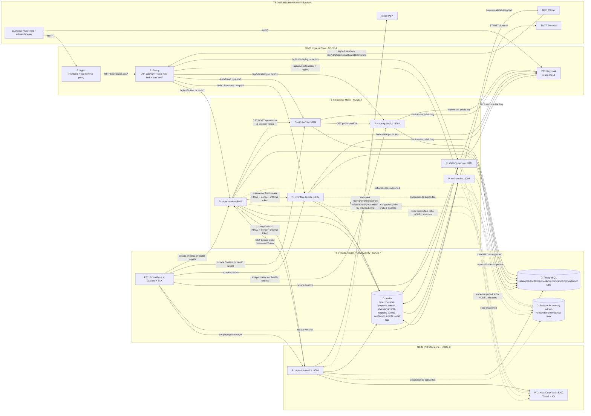
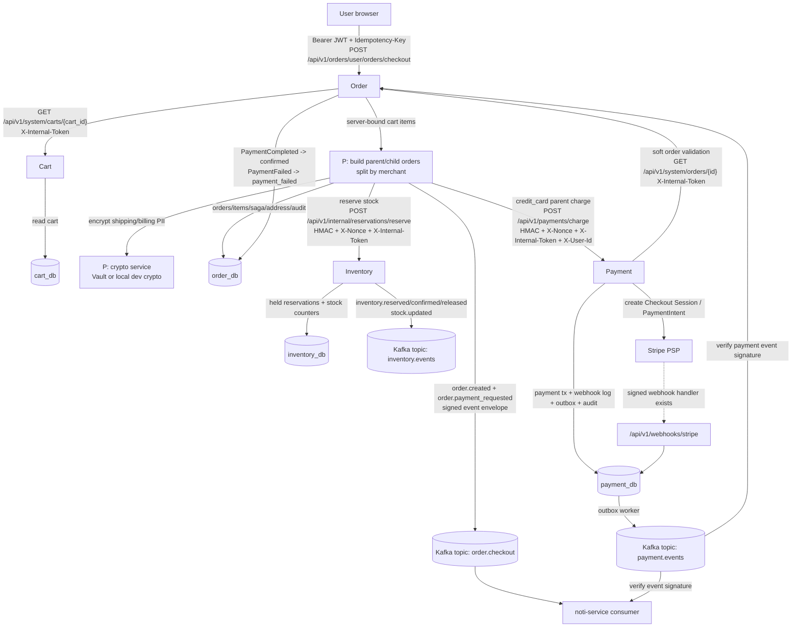
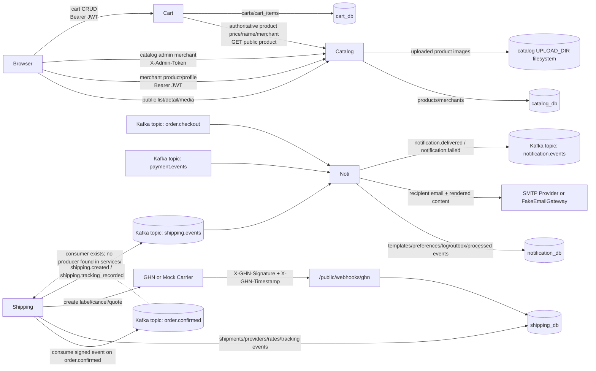

# Data Flow Diagram va Trust Boundaries

Pham vi: chi dua tren code/config trong `services/` va `infra/`. Khong su dung README, implementation notes hay docs de suy dien.

Gia dinh:
- Runtime chinh duoc hieu theo `infra/vm-setup/*` neu co mau thuan voi default trong service code.
- Khi code va infra lech nhau, ghi ro la "quan sat lech", khong tu hop thuc hoa.
- "Trust Boundary" la diem du lieu di qua vung mang, actor, co che xac thuc, hoac vung luu tru khac muc tin cay.

## DFD Level 0

## DFD Level 1 - Checkout va payment

## DFD Level 1 - Catalog, cart, shipping, notification

## Trust Boundaries

| ID | Boundary | Crossing data | Protection visible in code/infra |
|---|---|---|---|
| TB-00 | Public Internet -> NODE-1 ingress | Browser requests, OAuth redirects, API calls, carrier webhooks | Nginx public port 80; Envoy receives `/api/*`; Lua WAF blocks common SQLi/XSS/path traversal/scanners; Envoy local rate limit 100 req/min. |
| TB-01 | Browser -> Keycloak | Credentials, auth code/token flow, JWT | Keycloak realm `nt219`, brute-force protection, PKCE client `frontend-spa`, services verify RS256 JWT by fetching realm public key. |
| TB-02 | Nginx -> Envoy | API traffic | Nginx proxies `/api/` to `https://127.0.0.1:10000`; `proxy_ssl_verify off` in infra script. Envoy has downstream TLS cert. |
| TB-03 | Envoy -> NODE-2 services | Routed API requests | NODE-2 firewall allows service ports 8001/8002/8003/8005/8007/8008 from NODE-1 and NODE-4 only. Checked-in `services/envoy.yaml` has upstream TLS only for order-service, but generated infra Envoy config routes all NODE-2 services without upstream TLS. |
| TB-04 | Public/merchant/admin API -> service process | JWT, admin token, uploads, product/order/cart/shipment data | Catalog/Cart/Order/Inventory/Shipping merchant routes verify Keycloak JWT. Shipping admin uses JWT role check. Catalog admin uses `X-Admin-Token`. Notification admin uses `X-Admin-Token`; POST/PATCH also pass nonce guard. |
| TB-05 | S2S internal calls | Order -> Payment, Order -> Inventory, Order -> Cart, Payment -> Order | Order->Payment and Order->Inventory use HMAC request signature, timestamp, nonce, and `X-Internal-Token`. Order->Cart uses `X-Internal-Token` only. Payment->Order system lookup uses `X-Internal-Token` only; no HMAC because endpoint is `/system/orders/{id}` and Order HMAC middleware only enforces `/internal/`. |
| TB-06 | Service -> PostgreSQL | Business state, PII, audit logs, outbox | NODE-4 Postgres allows VM2/VM3 in infra. Service code uses SQLAlchemy async sessions. Some PII is encrypted before storage: order addresses, inventory warehouse address, shipping recipient/address, notification recipient/subject/variables when crypto is active. |
| TB-07 | Service -> Kafka event bus | Domain events and audit events | Producers sign event envelopes through crypto service. Consumers in Order/Shipping/Notification verify signatures before handling. Kafka infra is PLAINTEXT on 9092; no TLS/SASL visible. |
| TB-08 | Service -> Redis or fallback | Nonces, idempotency keys, notification rate limit | Code supports Redis stores and production fail-fast in several containers. Infra scripts disable Redis for most NODE-2 services and NODE-3 payment; notification enables Redis URL, but NODE-4 infra does not provision Redis. Non-production code falls back to in-memory stores if enabled Redis is unreachable. |
| TB-09 | Services -> Vault | Transit encrypt/decrypt/HMAC/sign, Stripe/SMTP/GHN secrets | NODE-3 installs Vault and transit/KV. Payment reads Stripe secrets from Vault and uses transit if available. Order/Inventory/Shipping/Notification code supports Vault, but NODE-2 infra sets `VAULT_ENABLED=false`; local dev crypto is then used unless production fail-fast triggers. |
| TB-10 | Payment -> Stripe | Checkout sessions, PaymentIntents, Refunds, webhook events | Stripe API key and webhook secret are config/Vault-backed. Webhook endpoint verifies `Stripe-Signature` and deduplicates by PSP event id in DB. Provided ingress/firewall does not expose Payment webhook publicly. |
| TB-11 | Shipping -> GHN carrier | Label creation/cancel/quote, tracking webhooks | Outbound GHN uses `Token` header. Inbound GHN webhook requires `X-GHN-Signature` and `X-GHN-Timestamp` HMAC over `timestamp.payload`. Mock webhook disabled in production. |
| TB-12 | Notification -> SMTP | Recipient email, rendered subject/body | SMTP gateway uses STARTTLS with cert validation when configured. If SMTP credentials are missing, FakeEmailGateway is used. Notification DB stores masked/encrypted recipient data when crypto is active. |
| TB-13 | Observability/admin data | Metrics, logs, dashboards | NODE-4 exposes Grafana/Kibana/Prometheus/Elasticsearch demo ports. Prometheus config scrapes service targets; `/metrics` endpoints are present in Inventory/Shipping/Notification code. Logstash is configured, but no service-side Filebeat/Logstash sender is visible in `services/`. |

## Data Flows

| Flow | Source -> Sink | Data | Boundary / auth |
|---|---|---|---|
| F01 | Browser -> Nginx -> Envoy -> Catalog | Public product list/detail and product media | Public route through WAF/rate limit. |
| F02 | Browser -> Keycloak -> service JWT validation | Login/registration and Bearer JWT | Keycloak issues token; services fetch realm public key and verify issuer/signature. |
| F03 | Merchant browser -> Catalog | Product/profile CRUD, image upload | Bearer JWT; product image content-type plus magic-byte sniff; upload path uses UUID merchant id. |
| F04 | Catalog -> catalog_db / filesystem | Merchants, products, product images | DB write and `UPLOAD_DIR` filesystem. |
| F05 | Browser -> Cart -> Catalog -> cart_db | Cart items, server-side product price/name lookup | User JWT into Cart; Cart calls Catalog public product endpoint; no service token in actual client code. |
| F06 | Browser -> Order -> Cart | Checkout payload, server-bound cart snapshot | User JWT + `Idempotency-Key`; Order retrieves Cart through system endpoint with `X-Internal-Token`. |
| F07 | Order -> order_db | Parent/child orders, items, saga, encrypted addresses, audit | Address PII encrypted through crypto service; audit stored with HMAC signature. |
| F08 | Order -> Inventory -> inventory_db | Reserve/release/confirm stock | HMAC + nonce + `X-Internal-Token`; Inventory writes reservation/stock changes and outbox events. |
| F09 | Order -> Payment -> Stripe | Charge/refund requests, amount, line items, Stripe session/intent | HMAC + nonce + `X-Internal-Token`; Payment calls Stripe. |
| F10 | Payment -> Order | Order owner/amount validation | `X-Internal-Token` only; Payment code treats some Order validation failures as warning and continues. |
| F11 | Stripe -> Payment webhook | PSP event payload | Code verifies `Stripe-Signature`; infra does not route this endpoint from public ingress. |
| F12 | Payment outbox -> Kafka -> Order/Notification | `PaymentCompleted`, `PaymentFailed`, `RefundCompleted`, `SettlementPaid` | Signed Kafka envelope; Order verifies payment signature before status update. |
| F13 | Order -> Kafka -> Notification | `order.created`, `order.status_changed`, `order.payment_requested` | Signed event envelope on `order.checkout`; Notification verifies before sending email. |
| F14 | Shipping consumer -> shipment DB -> carrier | Shipment creation from `order.confirmed`, carrier label | Consumer exists for `order.confirmed`; no producer for that topic found in `services/`. |
| F15 | GHN -> Shipping webhook -> shipping DB -> Kafka | Tracking status updates | GHN HMAC/timestamp; records tracking event and publishes `shipping.tracking_recorded`. |
| F16 | Notification -> notification DB -> SMTP -> Kafka | Rendered email, delivery/failure result | Event signature verify, Redis idempotency/rate limit if available, SMTP STARTTLS if configured. |
| F17 | Services -> audit DB/Kafka | Audit payloads, HMAC signatures | Order writes audit DB and Kafka; Payment/Inventory/Shipping/Noti publish audit events through their event publisher. |

## Source Evidence Map

Core runtime files checked:
- Ingress and network: `infra/vm-setup/node-1/02-setup-ingress.sh`, `infra/vm-setup/node-2/02-setup-services.sh`, `infra/vm-setup/node-3/02-setup-payment.sh`, `infra/vm-setup/node-4/02-install-data-obs.sh`, `services/envoy.yaml`, `infra/patches/waf.lua`.
- Catalog: `services/catalog-service/app/main.py`, `app/api/dependencies.py`, `app/api/v1/router.py`, `app/api/v1/merchant/product.py`, `app/api/v1/public/media.py`, `app/core/config.py`.
- Cart: `services/cart-service/app/main.py`, `app/api/dependencies.py`, `app/api/v1/user/cart.py`, `app/api/v1/system/cart.py`, `app/clients/catalog_client.py`, `app/crud/cart.py`.
- Order: `services/order-service/app/main.py`, `app/api/dependencies.py`, `app/api/middleware/*`, `app/api/v1/*`, `app/application/use_cases/checkout.py`, `app/application/saga/*`, `app/infrastructure/external/*`, `app/infrastructure/messaging/*`, `app/infrastructure/container.py`.
- Payment: `services/payment-service/app/main.py`, `app/api/middleware/*`, `app/api/v1/*`, `app/application/use_cases/*`, `app/infrastructure/external/stripe_client.py`, `app/infrastructure/external/order_client.py`, `app/infrastructure/messaging/*`, `app/infrastructure/container.py`.
- Inventory: `services/inventory-service/app/main.py`, `app/api/middleware/*`, `app/api/v1/*`, `app/application/use_cases/*`, `app/infrastructure/messaging/*`, `app/infrastructure/container.py`.
- Shipping: `services/shipping-service/app/main.py`, `app/api/middleware/*`, `app/api/v1/*`, `app/application/use_cases/*`, `app/infrastructure/external/*`, `app/infrastructure/messaging/*`, `app/infrastructure/container.py`.
- Notification: `services/noti-service/app/main.py`, `app/api/*`, `app/application/use_cases/*`, `app/infrastructure/email/smtp_email_gateway.py`, `app/infrastructure/messaging/*`, `app/infrastructure/container.py`.

## Quan sat lech / can xac minh

1. `shipping-service` consume Kafka topic `order.confirmed`, nhung trong `services/` chi thay Order publish `order.created`, `order.status_changed`, `order.payment_requested` vao `order.checkout`. Khong thay producer cho `order.confirmed`.
2. Payment co public Stripe webhook route `/api/v1/webhooks/stripe`, nhung Envoy/Nginx infra khong route payment-service, va NODE-3 firewall chi mo `8004` cho VM2. Stripe khong co duong public vao Payment theo infra hien tai.
3. Kafka topics do infra tao la `order-commands`, `order-events`, `inventory-commands`, `payment-commands`, `notification-events`; service code dung `order.checkout`, `payment.events`, `inventory.events`, `shipping.events`, `notification.events`, `audit-logs`, `notification.dlq`, `order.confirmed`. Docker Kafka bat auto-create, nhung script systemd topic list khong khop code.
4. Redis duoc code dung cho nonce/idempotency/rate-limit, nhung infra NODE-4 khong cai Redis. NODE-2 setup tat Redis cho hau het service, rieng noti bat `REDIS_URL=redis://VM4:6379/8`, nen can bo sung Redis hoac tat Redis cho noti trong moi truong demo.
5. Vault duoc cai tren NODE-3 va payment dung Vault. NODE-2 setup lai dat `VAULT_ENABLED=false` cho catalog/cart/order/inventory/shipping/noti, nen cac service nay khong dung Vault trong deployment script hien tai.
6. `services/envoy.yaml` co upstream TLS cho `order_service`, nhung Envoy config sinh boi `infra/vm-setup/node-1/02-setup-ingress.sh` khong co upstream TLS cho NODE-2 services. Neu deploy bang script, traffic Envoy -> service la HTTP noi bo.
7. Payment -> Order order validation co token default khong khop trong code/infra: Payment default `ORDER_SERVICE_INTERNAL_TOKEN=payment_to_order_dev_token`, Order default `INTERNAL_API_TOKEN=order_internal_dev_token`. Khi Order validation loi `ForbiddenException`/`BusinessRuleException`, Payment chi log warning roi tiep tuc.
8. Prometheus scrape tat ca service target, nhung `/metrics` chi thay ro trong Inventory, Shipping, Notification. Catalog, Cart, Order, Payment co `/health`, khong thay `/metrics` endpoint trong code da doc.
9. Logstash/ELK duoc provision trong infra, nhung trong `services/` khong thay Filebeat/logstash client gui log den `LOGSTASH_HOST`.

