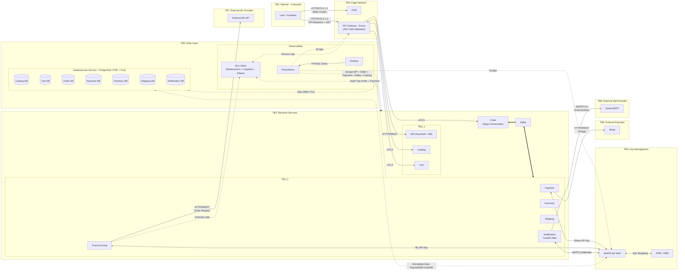
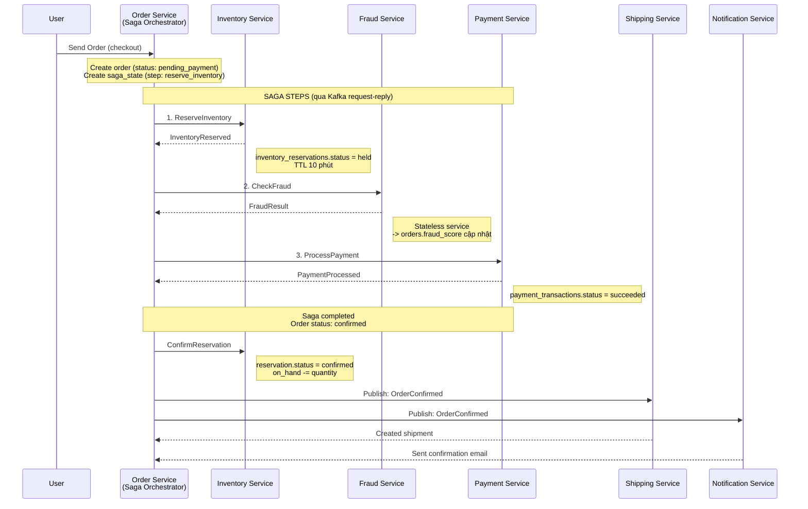
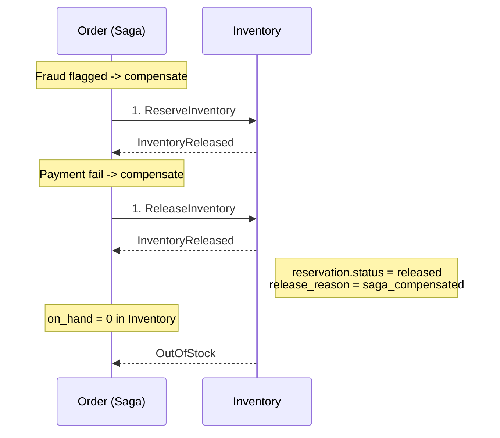

# Data Flow Diagram - E-Commerce Platform

## Tổng quan quyết định thiết kế

| Quyết định         | Kết quả                                                                                                 |
| ------------------ | ------------------------------------------------------------------------------------------------------- |
| Keycloak           | Giữ ở **TB3 (Services)** - stateful, cần model trust boundary crossing GW<->IdP                         |
| ML Fraud Scoring   | TB3 + kết nối **external ML API** (TB7)                                                                 |
| Notification       | TB3, dùng **FastAPI-Mail** -> kết nối **Gmail SMTP** (TB8)                                              |
| CDN                | Giữ ở **TB2 (Edge Network)**                                                                            |
| Service-to-Service | **Async qua Kafka** (TB3 - cùng cluster với services)                                                   |
| Auth               | GW dùng **JWT self-validation**, kết nối IdP cho OIDC login/token/JWKS                                  |
| Database Pattern   | **Database-per-service** - mỗi service có PostgreSQL instance riêng (TDE + FLE)                         |
| Key Management     | Payment, Fraud, Notification lấy external credentials từ Vault; tất cả DBs lấy encryption keys từ Vault |
| Observability      | **ELK** (audit logs), **Prometheus** (metrics scraping), **Grafana** (dashboards) - đặt trong TB4       |
| Prometheus Targets | GW, Keycloak, Order, Payment, Kafka, tất cả PostgreSQL instances, Vault                                 |
| Checkout Flow      | **Saga orchestration** - Order Service điều phối: Reserve Inventory -> Check Fraud -> Process Payment   |
| Settlement         | **Marketplace model** - Platform thu hộ buyer -> trừ hoa hồng -> chuyển cho merchant theo kỳ            |

---

## Data Flow Diagram

---

## Order Saga Flow

> [!IMPORTANT]
> Order Service đóng vai trò **Saga Orchestrator** - điều phối toàn bộ checkout flow qua Kafka commands (request-reply pattern). Nếu bất kỳ bước nào fail -> saga compensate (rollback) các bước đã hoàn thành.

**Compensation (khi có lỗi):**

---
