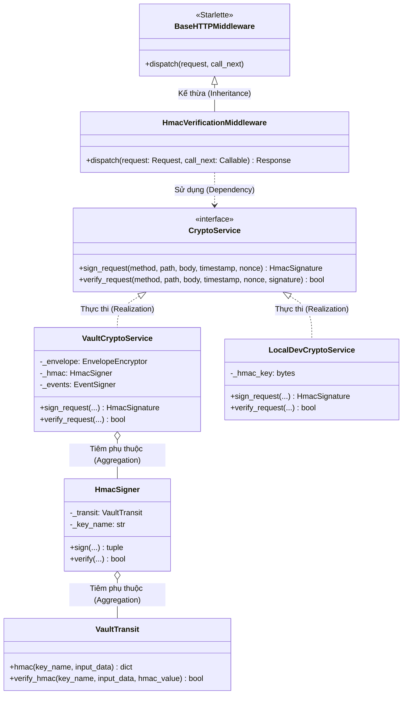
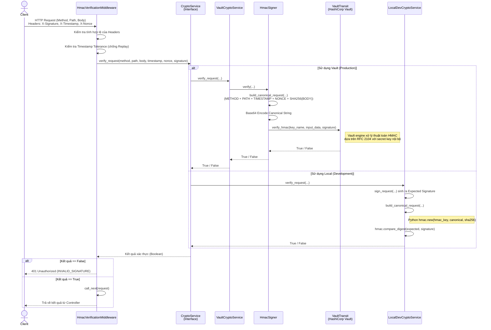

# Kiến Trúc và Luồng Xử Lý HMAC

Tài liệu này mô tả kiến trúc và luồng xử lý HMAC dựa trên cấu trúc thực tế trong codebase, tuân thủ các tiêu chuẩn UML hiện đại.

## 1. Sơ Đồ Lớp (Class Diagram)

Sơ đồ thể hiện rõ các pattern đang được áp dụng trong code:

- **Dependency Injection / Strategy Pattern**: Thông qua interface `CryptoService`.
- **Mối quan hệ UML chuẩn**: `Realization` (Thực thi interface), `Inheritance` (Kế thừa), `Association/Aggregation` (Tiêm phụ thuộc).

**Giải thích:**

- Các hàm/phương thức tiện ích như `build_canonical_request` được thiết kế dạng standalone function trong codebase nên không đại diện như một class độc lập.

---

## 2. Sơ Đồ Tuần Tự (Sequence Diagram)

Sơ đồ này phản ánh logic chi tiết trong mã nguồn khi một HTTP Request đi qua Middleware xác thực HMAC, và đi sâu vào cách Canonical Request được tạo ra.

**Tại sao áp dụng sơ đồ này?**

- Tuân thủ cấu trúc codebase thực tế (chỉ gọi logic trong các service và hàm helper `build_canonical_request`), thay vì cố gắng mapping các toán tử bitwise của RFC 2104 (như `ipad`/`opad`) vốn bị ẩn hoàn toàn bởi thư viện `hmac` (trong Python) hoặc engine Vault.
- Giúp developer nhanh chóng theo dõi được luồng đi của dữ liệu từ tầng Middleware, qua Interface, đến quá trình mã hóa/giải mã ở các Implementation khác nhau.
