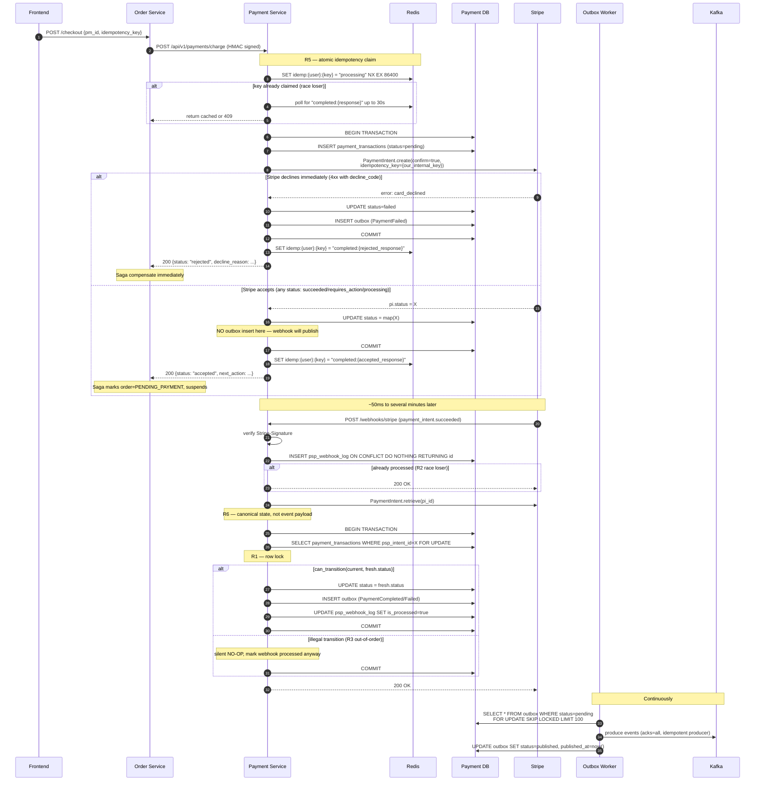

# Payment-Service Production Architecture (v2 — race & migration hardened)

## 0. Decisions locked

| Decision         | Choice                                                                 | Implication                                                                                                                                                                      |
| ---------------- | ---------------------------------------------------------------------- | -------------------------------------------------------------------------------------------------------------------------------------------------------------------------------- |
| Stripe mode      | **Elements (client tokenize)**                                         | Backend never sees PAN. PCI SAQ-A.                                                                                                                                               |
| 3DS flow         | **Hybrid sync + async webhook**                                        | Sync `/charge` returns `accepted` or `rejected_now`; truthful state via webhook only.                                                                                            |
| Event publishing | **Strict: webhook handler is sole publisher**                          | Sync handler never publishes Kafka. Order saga ALWAYS waits for `PaymentCompleted` event. Tradeoff: ~50-200ms extra latency even for frictionless. Gain: zero dual-publish race. |
| Race handling    | **State machine + row lock + atomic dedup + Stripe re-fetch + outbox** | All 6 race cases mitigated by design.                                                                                                                                            |
| DB migration     | **Alembic from day 1**                                                 | Required for partition (audit_log) + trigger + future ALTER. No `create_all`.                                                                                                    |
| Scope            | Full (charge + refund + webhook + settlement cron + reconciliation)    | 8 tables per dbml/04_payment.dbml                                                                                                                                                |
| Webhook delivery | ngrok tunnel                                                           | Public URL → Stripe Dashboard                                                                                                                                                    |

---

## 1. Cross-service contract (updated for strict event-sourcing)

### `POST /api/v1/payments/charge` — sync response narrowed

Previous: `{status: "succeeded|processing|authorized|failed"}`  
**New**: `{status: "accepted|rejected"}` only.

```json
// Accepted (Stripe received, webhook will deliver truth)
{
  "payment_id": "uuid",
  "status": "accepted",
  "psp_intent_id": "pi_xxx",
  "next_action": null | {"type": "redirect_to_url", "url": "..."}
}

// Rejected immediately (no webhook coming)
{
  "payment_id": "uuid",
  "status": "rejected",
  "decline_reason": "insufficient_funds",
  "decline_code": "card_declined"
}
```

### Order-service saga MUST change

Old saga: `ProcessPayment → if success advance`  
New saga: `ProcessPayment → ALWAYS persist pending_payment + suspend → resume via Kafka PaymentCompleted/PaymentFailed`

Files to modify in order-service:

- [services/order-service/app/domain/value_objects/order_status.py](services/order-service/app/domain/value_objects/order_status.py) — add `PENDING_PAYMENT`
- [services/order-service/app/application/saga/orchestrator.py](services/order-service/app/application/saga/orchestrator.py) — never advance on charge response; suspend after `accepted`
- [services/order-service/app/infrastructure/messaging/kafka_consumer.py](services/order-service/app/infrastructure/messaging/kafka_consumer.py) — wire in main.py; subscribe `payment.events`; resume saga by `order_id` correlation
- Add timeout worker: order in `pending_payment` > 30 min → call `payment-svc GET /api/v1/payments/{id}` to reconcile → if Stripe says failed, mark order failed

---

## 2. Directory structure (final)

```
services/payment-service/
├── Dockerfile
├── requirements.txt
├── pytest.ini
├── alembic.ini
├── alembic/
│   ├── env.py                          # async asyncpg config
│   ├── script.py.mako
│   └── versions/
│       ├── 0001_initial_schema.py
│       ├── 0002_outbox_table.py
│       ├── 0003_audit_log_partitioned.py
│       ├── 0004_audit_trigger.py
│       └── 0005_monthly_partition_helper.py
├── .env.example
└── app/
    ├── main.py                        # lifespan: alembic_check → init_container → start outbox_worker
    ├── core/{config,exceptions}.py
    ├── domain/
    │   ├── entities/
    │   ├── ports/                     # +OutboxRepository
    │   ├── events/
    │   └── value_objects/
    │       └── payment_status.py      # includes can_transition() class method
    ├── application/
    │   ├── dto/
    │   └── use_cases/
    │       ├── charge.py              # NEVER publishes; only persists + outbox-insert on rejection
    │       ├── refund.py              # outbox-insert refund-pending event
    │       ├── handle_webhook.py      # SOLE PUBLISHER (via outbox)
    │       ├── get_payment.py         # also used for timeout reconciliation
    │       ├── generate_settlement.py
    │       ├── process_settlement.py
    │       └── reconcile_balance.py
    ├── infrastructure/
    │   ├── container.py
    │   ├── crypto/                    # copy from order-service
    │   ├── persistence/
    │   │   ├── database.py            # NO create_all; alembic only
    │   │   ├── models/                # 8 dbml tables + outbox_event_model
    │   │   └── repositories/
    │   ├── cache/{redis_nonce_store,redis_idempotency_store}.py
    │   ├── messaging/
    │   │   ├── kafka_producer.py
    │   │   ├── kafka_consumer.py
    │   │   ├── outbox_worker.py       # NEW: polls outbox → publishes → marks
    │   │   └── event_schemas.py
    │   ├── external/
    │   │   ├── stripe_client.py
    │   │   └── bank_payout_stub.py
    │   ├── audit/kafka_audit_logger.py
    │   └── scheduler/
    │       └── settlement_cron.py
    ├── api/
    │   ├── dependencies.py
    │   ├── middleware/{hmac_verification,nonce_guard}.py
    │   └── v1/
    │       ├── router.py
    │       ├── internal/payments.py
    │       ├── public/webhooks.py
    │       └── admin/settlements.py
    └── schemas/
```

---

## 3. Phase 0 — Infrastructure prerequisites

### 3.1 `infra/docker-compose.yml` — add Redis

```yaml
redis:
  image: redis:7.4-alpine
  ports: ["6379:6379"]
  networks: [backend]
  command:
    [
      "redis-server",
      "--maxmemory",
      "256mb",
      "--maxmemory-policy",
      "allkeys-lru",
    ]
```

### 3.2 `infra/vault/policies/payment-svc.hcl` — add missing

```hcl
path "transit/verify/order-hmac-key"   { capabilities = ["update"] }
path "transit/sign/payment-sign-key"   { capabilities = ["update"] }
path "transit/verify/payment-sign-key" { capabilities = ["update"] }
path "transit/encrypt/payment-fle-key" { capabilities = ["update"] }
path "transit/decrypt/payment-fle-key" { capabilities = ["update"] }
path "transit/rewrap/payment-fle-key"  { capabilities = ["update"] }
path "transit/hmac/payment-audit-key"   { capabilities = ["update"] }
path "transit/verify/payment-audit-key" { capabilities = ["update"] }
```

### 3.3 `infra/vault/scripts/init-vault.sh` — add AppRole + transit keys

```bash
vault write -f transit/keys/payment-sign-key  type=ecdsa-p256 || true
vault write -f transit/keys/payment-fle-key   type=aes256-gcm96 || true
vault write -f transit/keys/payment-audit-key type=aes256-gcm96 || true

vault write auth/approle/role/payment-service \
  token_policies="payment-svc" token_ttl=1h token_max_ttl=4h \
  secret_id_ttl=24h secret_id_num_uses=10
```

### 3.4 Stripe + ngrok setup (documented in README, no secrets committed)

- Stripe Dashboard test mode → `sk_test_...`, `pk_test_...`, `whsec_...`
- `vault kv put secret/payment/stripe api_key=sk_test_... webhook_secret=whsec_... publishable_key=pk_test_...`
- ngrok: `ngrok http 8004` → configure endpoint in Stripe Dashboard, subscribe: `payment_intent.succeeded`, `payment_intent.payment_failed`, `payment_intent.requires_action`, `payment_intent.canceled`, `charge.refunded`, `charge.dispute.created`

---

## 4. Phase 1 — Bootstrap + Alembic FIRST

### 4.1 `requirements.txt`

```
fastapi==0.115.*
uvicorn[standard]==0.32.*
sqlalchemy[asyncio]==2.0.*
asyncpg==0.29.*
aiosqlite==0.20.*
alembic==1.13.*              # NEW — required from day 1
pydantic==2.9.*
pydantic-settings==2.6.*
hvac==2.3.*
cryptography==43.*
aiokafka==0.11.*
httpx==0.27.*
redis[hiredis]==5.1.*
stripe==11.*
apscheduler==3.10.*
prometheus-client==0.21.*
tenacity==9.*                # NEW — retry with backoff for Stripe
pytest, pytest-asyncio, pytest-httpx
```

### 4.2 Alembic async setup (`alembic/env.py` essentials)

```python
import asyncio
from logging.config import fileConfig
from sqlalchemy import pool
from sqlalchemy.engine import Connection
from sqlalchemy.ext.asyncio import async_engine_from_config
from alembic import context

from app.infrastructure.persistence.models.base import Base
from app.core.config import settings

config = context.config
config.set_main_option("sqlalchemy.url", settings.database_url)
target_metadata = Base.metadata

def do_run_migrations(connection: Connection) -> None:
    context.configure(
        connection=connection,
        target_metadata=target_metadata,
        compare_type=True,            # detect column type changes
        compare_server_default=True,  # detect default changes
        render_as_batch=False,
    )
    with context.begin_transaction():
        context.run_migrations()

async def run_async_migrations() -> None:
    connectable = async_engine_from_config(
        config.get_section(config.config_ini_section, {}),
        prefix="sqlalchemy.",
        poolclass=pool.NullPool,
    )
    async with connectable.connect() as connection:
        await connection.run_sync(do_run_migrations)
    await connectable.dispose()

def run_migrations_online() -> None:
    asyncio.run(run_async_migrations())

if context.is_offline_mode():
    raise RuntimeError("Offline mode not supported")
else:
    run_migrations_online()
```

### 4.3 Migration files

- `0001_initial_schema.py` — autogen from models for 7 standard tables (payment_methods, payment_transactions, idempotency_keys, psp_webhook_log, merchant_settlements, settlement_items + `payment_outbox`). Indexes per dbml.
- `0002_outbox_table.py` — `payment_outbox`: `id uuid pk, aggregate_type, aggregate_id, event_type, payload jsonb, created_at, published_at, attempt_count, last_error, status (pending|published|failed)`. Index `(status, created_at) WHERE status='pending'`.
- `0003_audit_log_partitioned.py` — raw SQL (Alembic `op.execute`):

  ```sql
  CREATE TABLE payment_audit_log (
      id uuid NOT NULL,
      created_at timestamptz NOT NULL,
      table_name varchar(100) NOT NULL,
      ...
      PRIMARY KEY (id, created_at)
  ) PARTITION BY RANGE (created_at);

  -- initial 3 months partitions
  CREATE TABLE payment_audit_log_2026_05 PARTITION OF payment_audit_log
      FOR VALUES FROM ('2026-05-01') TO ('2026-06-01');
  -- ... etc
  ```

- `0004_audit_trigger.py` — `CREATE FUNCTION audit_payment_changes()` + triggers on payment_methods, payment_transactions, merchant_settlements (AFTER INSERT/UPDATE/DELETE).
- `0005_monthly_partition_helper.py` — `CREATE FUNCTION create_next_month_partition()` + APScheduler calls monthly.

### 4.4 `main.py` lifespan (production startup order)

```python
@asynccontextmanager
async def lifespan(app):
    # 1. Verify schema matches alembic head (fail fast)
    if settings.alembic_check_on_startup:
        check_alembic_head()  # raises if mismatch
    # 2. Init DI container (Vault, Redis, Kafka, Stripe)
    await init_container()
    # 3. Start outbox publisher worker (single instance per pod ok; uses FOR UPDATE SKIP LOCKED)
    outbox_task = asyncio.create_task(run_outbox_worker())
    # 4. Start settlement cron
    scheduler.start()
    yield
    scheduler.shutdown()
    outbox_task.cancel()
    await shutdown_container()
```

---

## 5. Phase 2 — Domain layer with state machine

### 5.1 `value_objects/payment_status.py`

```python
from enum import Enum
from typing import ClassVar

class PaymentStatus(str, Enum):
    PENDING            = "pending"
    PROCESSING         = "processing"
    REQUIRES_ACTION    = "requires_action"
    SUCCEEDED          = "succeeded"
    FAILED             = "failed"
    CANCELLED          = "cancelled"
    REFUND_PENDING     = "refund_pending"
    REFUNDED           = "refunded"
    PARTIALLY_REFUNDED = "partially_refunded"

    # Allowed forward transitions — anything else is REJECTED at app layer
    _ALLOWED: ClassVar[dict] = {
        "pending":         {"processing", "requires_action", "succeeded", "failed", "cancelled"},
        "processing":      {"requires_action", "succeeded", "failed", "cancelled"},
        "requires_action": {"succeeded", "failed", "cancelled"},
        "succeeded":       {"refund_pending"},
        "refund_pending":  {"refunded", "partially_refunded", "succeeded"},  # last = refund failed
        "partially_refunded": {"refund_pending", "refunded"},
        "failed":          set(),
        "cancelled":       set(),
        "refunded":        set(),
    }

    @classmethod
    def can_transition(cls, current: "PaymentStatus", target: "PaymentStatus") -> bool:
        return target.value in cls._ALLOWED[current.value]
```

**Why this matters**: blocks Race R3 (out-of-order webhook) at the value-object boundary — any handler attempting an illegal transition returns NO-OP, not error (out-of-order is expected, not a bug).

### 5.2 Stripe status → PaymentStatus mapping

| Stripe `pi.status`        | PaymentStatus     | When emitted                   |
| ------------------------- | ----------------- | ------------------------------ |
| `requires_payment_method` | `failed`          | Card decline                   |
| `requires_action`         | `requires_action` | 3DS challenge                  |
| `processing`              | `processing`      | Stripe internal                |
| `succeeded`               | `succeeded`       | Charge captured                |
| `canceled`                | `cancelled`       | Explicit cancel                |
| `requires_capture`        | `processing`      | 2-step capture (not used here) |

### 5.3 Domain events (published via outbox)

- `PaymentCompleted` (payment_id, order_id, amount, currency, paid_at)
- `PaymentFailed` (payment_id, order_id, failure_code, failure_message)
- `PaymentRequiresAction` (payment_id, order_id, next_action_url) — optional, for UI notification
- `RefundCompleted` (payment_id, order_id, refund_amount, is_full)
- `SettlementPaid` (settlement_id, merchant_id, net_amount)

---

## 6. Phase 3 — Race condition mitigations (the hard part)

### 6.1 Six race cases & their fixes

| #      | Race                                                         | Fix                                                                                                                           | Where implemented                        |
| ------ | ------------------------------------------------------------ | ----------------------------------------------------------------------------------------------------------------------------- | ---------------------------------------- |
| **R1** | Webhook arrives before sync handler commits                  | Sync handler holds `SELECT FOR UPDATE` on payment_transactions row until commit; webhook waits                                | `ChargeUseCase`, `HandleWebhookUseCase`  |
| **R2** | Stripe retries webhook → concurrent handlers same `event_id` | `INSERT ... ON CONFLICT (psp_provider, event_id) DO NOTHING RETURNING id` atomic                                              | `PgWebhookLogRepository.insert_if_new()` |
| **R3** | Out-of-order webhook downgrades state                        | `PaymentStatus.can_transition()` check before UPDATE; illegal = silent NO-OP                                                  | `HandleWebhookUseCase`                   |
| **R4** | Dual publish (sync + webhook)                                | **Strict rule**: only webhook handler inserts into outbox; sync handler never publishes                                       | `ChargeUseCase` does NOT publish         |
| **R5** | Concurrent same idempotency_key                              | Redis `SET key NX EX 86400` atomic claim; loser polls for cached response                                                     | `RedisIdempotencyStore.claim_or_wait()`  |
| **R6** | Webhook reads stale state                                    | (1) Row lock per R1. (2) Webhook handler ALWAYS calls `stripe.PaymentIntent.retrieve()` to get canonical status before UPDATE | `HandleWebhookUseCase`                   |

### 6.2 Charge flow (final, strict event-sourcing)



### 6.3 `PgWebhookLogRepository.insert_if_new()` — atomic dedup

```python
async def insert_if_new(self, session, event_id, psp_provider, payload, signature):
    stmt = (
        insert(PspWebhookLogModel)
        .values(
            event_id=event_id,
            psp_provider=psp_provider,
            payload=payload,
            signature=signature,
            is_verified=True,
            is_processed=False,
        )
        .on_conflict_do_nothing(
            index_elements=['psp_provider', 'event_id']
        )
        .returning(PspWebhookLogModel.id)
    )
    result = await session.execute(stmt)
    return result.scalar()  # None if duplicate
```

### 6.4 `RedisIdempotencyStore.claim_or_wait()`

```python
async def claim_or_wait(self, user_id, key, request_hash, wait_timeout=30):
    redis_key = f"payment:idemp:{user_id}:{key}"
    claimed = await self.redis.set(
        redis_key,
        json.dumps({"status": "processing", "hash": request_hash}),
        nx=True, ex=86400,
    )
    if claimed:
        return IdempotencyClaim.NEW

    # Race loser: poll for completion
    deadline = time.monotonic() + wait_timeout
    while time.monotonic() < deadline:
        cached = await self.redis.get(redis_key)
        data = json.loads(cached)
        if data["status"] == "completed":
            if data["hash"] != request_hash:
                raise IdempotencyPayloadMismatchError()  # 409
            return IdempotencyClaim.cached(data["response"])
        await asyncio.sleep(0.2)
    raise IdempotencyTimeoutError()  # 409 retry-after
```

### 6.5 Outbox worker (`infrastructure/messaging/outbox_worker.py`)

```python
async def run_outbox_worker():
    while not shutdown_event.is_set():
        try:
            async with AsyncSessionLocal() as session, session.begin():
                rows = await session.execute(
                    select(OutboxEventModel)
                    .where(OutboxEventModel.status == 'pending')
                    .where(OutboxEventModel.attempt_count < MAX_ATTEMPTS)
                    .order_by(OutboxEventModel.created_at)
                    .limit(BATCH_SIZE)
                    .with_for_update(skip_locked=True)
                )
                events = rows.scalars().all()

                for ev in events:
                    try:
                        await kafka_publisher.publish(
                            topic=ev.topic,
                            key=ev.aggregate_id,
                            event=ev.payload,
                        )
                        ev.status = 'published'
                        ev.published_at = utcnow()
                    except Exception as e:
                        ev.attempt_count += 1
                        ev.last_error = str(e)[:1000]
                        if ev.attempt_count >= MAX_ATTEMPTS:
                            ev.status = 'failed'  # DLQ-like
                            await alert_ops(ev)

            if not events:
                await asyncio.sleep(0.5)
        except Exception:
            logger.exception("outbox worker iteration failed")
            await asyncio.sleep(1)
```

**Why `FOR UPDATE SKIP LOCKED`**: multiple worker instances (or pod replicas) can run safely without locking each other; each grabs a different unlocked batch.

---

## 7. Phase 4 — STRIDE mitigations (updated with race threats)

| STRIDE ID          | Threat                                                                | Implementation                                                                                                                                  |
| ------------------ | --------------------------------------------------------------------- | ----------------------------------------------------------------------------------------------------------------------------------------------- |
| **S-PAY-01**       | Spoofed webhook                                                       | `stripe.Webhook.construct_event(payload, sig, secret, tolerance=300)`                                                                           |
| **S-PAY-02**       | Replay charge                                                         | (1) Inbound HMAC + nonce middleware (Redis SET NX). (2) Atomic Redis idempotency claim. (3) Stripe Idempotency-Key passed downstream.           |
| **T-PAY-01**       | Amount tampering                                                      | Server-side amount from order DB; HMAC signs full body; verify `pi.amount == order.total`                                                       |
| **T-PAY-02**       | Token substitution                                                    | Verify `pm.customer == user.psp_customer_id` lookup                                                                                             |
| **T-PAY-03 (NEW)** | State regression via out-of-order webhook                             | `PaymentStatus.can_transition()` guard + canonical Stripe re-fetch in webhook handler                                                           |
| **S-PAY-03 (NEW)** | Duplicate webhook causes double Kafka publish → order confirmed twice | Atomic `ON CONFLICT DO NOTHING` on `psp_webhook_log`; outbox single-publisher pattern                                                           |
| **R-PAY-01**       | Chargeback                                                            | Force 3DS via `payment_method_options.card.request_three_d_secure="any"`; HMAC-chained `payment_audit_log` retained 7y; IP + device fingerprint |
| **I-PAY-01**       | PAN exposure                                                          | Stripe Elements client-tokenize; CSP allow only `js.stripe.com`                                                                                 |
| **I-PAY-02**       | Log leakage                                                           | `mask_psp_response()` before persist/log (strip card.last4, exp\_\*, fingerprint)                                                               |
| **D-PAY-01**       | PSP outage                                                            | `tenacity` retry exp backoff max 3; outbox retry; circuit breaker                                                                               |
| **D-PAY-02**       | Charge flood                                                          | Envoy rate limit 10rps/user; Redis token bucket                                                                                                 |
| **E-PAY-01**       | PSP secret leak                                                       | Vault AppRole least-privilege; distroless container; no logging of `api_key`                                                                    |

---

## 8. Phase 5 — Settlement & reconciliation

### 8.1 `generate_settlement` (weekly cron — APScheduler in-process for MVP)

For each merchant_id:

- Query `payment_transactions` WHERE `merchant_id=X AND status=succeeded AND order.delivered_at BETWEEN period`
- Compute: `total_sales`, `total_psp_fee` (sum from PSP fee column), `commission = total_sales × commission_rate (snapshot)`, `net = total_sales - commission - total_psp_fee`
- INSERT `merchant_settlements` (status=pending)
- INSERT `settlement_items` per transaction
- Outbox: `SettlementGenerated` event

### 8.2 `process_settlement` (admin trigger)

- Call `BankPayoutGateway.transfer_to_merchant()` — stub for Phase 1; Stripe Connect Transfer for Phase 2
- UPDATE status=paid, payment_reference
- Outbox: `SettlementPaid` event

### 8.3 `reconcile_balance` (daily 03:00 cron)

- `stripe.BalanceTransaction.list(created={gte: yesterday}, limit=100, paginate)`
- LEFT JOIN with `payment_transactions WHERE paid_at::date = yesterday`
- Mismatches → INSERT `reconciliation_discrepancy` (new table, plan addendum) + Slack alert via webhook

---

## 9. Phase 6 — Testing (race tests are non-negotiable)

### 9.1 Stripe test cards

| Card               | Scenario                                     |
| ------------------ | -------------------------------------------- |
| `4242424242424242` | Frictionless success                         |
| `4000000000003220` | 3DS required → auto-pass                     |
| `4000000000003063` | 3DS required → user fails                    |
| `4000000000009995` | Declined `insufficient_funds`                |
| `4000000000000341` | Attach OK, charge fails async (webhook test) |

### 9.2 Race condition tests (pytest-asyncio with mocked Stripe)

```python
# R2 test: concurrent same webhook event_id
async def test_concurrent_webhook_dedup():
    event = make_test_event(id="evt_123")
    results = await asyncio.gather(*[
        handle_webhook(event) for _ in range(10)
    ])
    assert sum(r.processed for r in results) == 1
    assert all(r.status_code == 200 for r in results)

# R3 test: out-of-order succeeded then requires_action
async def test_out_of_order_webhook_noop():
    await handle_webhook(event_succeeded("pi_x"))
    tx_before = await repo.get_by_intent("pi_x")
    await handle_webhook(event_requires_action("pi_x"))  # stale
    tx_after = await repo.get_by_intent("pi_x")
    assert tx_before.status == tx_after.status == "succeeded"

# R5 test: concurrent same idempotency_key
async def test_concurrent_idempotency_dedup():
    results = await asyncio.gather(*[
        charge(idempotency_key="abc", amount=100) for _ in range(5)
    ])
    payment_ids = {r.payment_id for r in results}
    assert len(payment_ids) == 1  # all share same payment
    assert stripe_mock.create_call_count == 1  # Stripe only called once

# R6 test: webhook with stale payload status, fresh re-fetch wins
async def test_webhook_uses_fresh_stripe_state():
    stripe_mock.set_pi_status("pi_x", "succeeded")
    event = event_payment_failed("pi_x")  # stale payload
    await handle_webhook(event)
    tx = await repo.get_by_intent("pi_x")
    assert tx.status == "succeeded"  # not failed
```

### 9.3 Alembic tests

- `alembic upgrade head` + `alembic downgrade base` (round-trip) for every migration
- `alembic check` in CI (detects schema drift)
- Partition test: insert audit log with timestamp 2 months future → must auto-route to correct partition or fail clearly

---

## 10. Phase 7 — Observability

- **Prometheus** `/metrics`:
  - `payment_charge_total{outcome="accepted|rejected"}`
  - `payment_charge_duration_seconds`
  - `payment_webhook_received_total{event_type, outcome="processed|duplicate|noop|invalid_sig"}`
  - `payment_webhook_signature_invalid_total` (CRITICAL alert)
  - `payment_idempotency_cache_hit_total`
  - `payment_outbox_pending_count` (gauge — alert > 100)
  - `payment_outbox_publish_duration_seconds`
  - `payment_state_transition_rejected_total{from, to}` (visibility into R3 hits)
  - `payment_settlement_amount_total{merchant_id, status}`
- **Structured logs** with `correlation_id` (= order trace_id), redaction policy for PSP responses
- **Audit logs** dual-write: `payment_audit_log` (HMAC chain) + Kafka `audit.payment`

---

## 11. Open / production TODOs

- Alembic ready from day 1 (resolved)
- Race conditions covered (resolved)
- Multi-PSP failover — Stripe only this iteration
- Stripe Connect for real payouts — stubbed
- Dispute management UI — out of scope
- mTLS order↔payment — config ready, cert provisioning pending
- DLQ for permanently failed outbox events — alert ops, manual replay
- Saga timeout reconciliation worker on order-svc side (30-min sweep) — explicitly required

---

## 12. Execution order

Each todo = 1 atomic PR. After Phase 0 (todo 1) and Phase 1 (todos 2+3) complete, most others parallelize.
