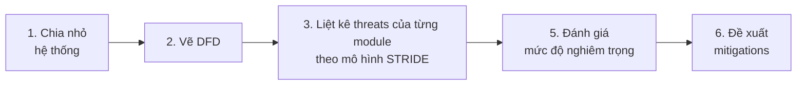

# STRIDE Threat Model  

## Mục lục  
1. [Giới thiệu STRIDE](#anchor-1 "#anchor-1")  
2. [Xác định phạm vi hệ thống](#anchor-2 "#anchor-2")  
3. [Phân tích STRIDE theo từng thành phần](#anchor-3 "#anchor-3")  
  

# 1. Giới thiệu STRIDE
STRIDE là phương pháp mô hình hóa mối đe dọa (threat modeling) do Microsoft phát triển. Mỗi chữ cái đại diện cho một loại mối đe dọa:  

| **Ký hiệu** | **Tên đầy đủ** | **Ý nghĩa** | **Vi phạm thuộc tính** |   
|-|-|-|-|  
| **S** | **Spoofing** | Giả mạo danh tính - kẻ tấn công giả làm người dùng hoặc service khác | Authentication |   
| **T** | **Tampering** | Giả mạo dữ liệu - sửa đổi dữ liệu trái phép | Integrity |   
| **R** | **Repudiation** | Chối bỏ hành vi - người dùng/service phủ nhận đã thực hiện hành động | Non-repudiation |   
| **I** | **Information Disclosure** | Lộ thông tin - dữ liệu nhạy cảm bị tiếp cận trái phép | Confidentiality |   
| **D** | **Denial of Service** | Từ chối dịch vụ - hệ thống bị quá tải hoặc không khả dụng | Availability |   
| **E** | **Elevation of Privilege** | Leo thang đặc quyền - kẻ tấn công có quyền vượt quá mức cho phép | Authorization |   

## Quy trình thực hiện STRIDE  

  

# 2. Xác định hệ thống

## 2.1. Entities

| **#** | **Thành phần** | **Loại** | **Mô tả** |   
|-|-|-|-|  
| 1 | Web SPA / Mobile App | External Entity | Client-side, untrusted |   
| 2 | CDN | External Entity | Cache static assets |   
| 3 | API Gateway (Envoy) | Process | TLS termination, JWT validation, rate limiting, WAF |   
| 4 | Identity Provider (Keycloak) | Process | OAuth2/OIDC, MFA, token issuance |   
| 5 | Catalog Service | Process | Public read, product data |   
| 6 | Cart Service | Process | User cart state, authenticated |   
| 7 | Order Service | Process | Checkout orchestration |   
| 8 | Payment Service | Process | Tokenization, PSP gateway integration |   
| 9 | Inventory / Shipping / Notification | Process | Supporting microservices |   
| 10 | Payment Gateway (Stripe) | External Entity | PSP sandbox, 3DS/SCA |   
| 11 | PostgreSQL Database | Data Store | TDE + field-level encryption |   
| 12 | KMS / HSM / Vault | Process | Key storage, envelope encryption, secrets |   
| 13 | Kafka | Data Flow | giao tiếp bất đồng bộ cho core microservices và stream dữ liệu cho hệ thống Anti-fraud. |   
| 14 | ML Fraud Scoring Service | Process | Anomaly detection, risk scoring |   
| 15 | CI/CD Pipeline | Process | Build, sign, deploy artifacts |   

  

# 3. Phân tích STRIDE theo từng thành phần

## 3.1. Frontend & Clients (Web SPA / Mobile App)

### S - Spoofing

| **ID** | **Mối đe dọa** | **Mô tả kịch bản tấn công** | **Severity** | **Mitigation** |   
|-|-|-|-|-|  
| S-FE-01 | Phishing / giả mạo trang login | Kẻ tấn công tạo trang login giả (clone UI), lừa user nhập credentials -> đánh cắp | High | Enforce HTTPS + HSTS, CSP headers, giáo dục users, implement WebAuthn (phishing-resistant) |   
| S-FE-02 | Token theft từ local storage | XSS -> đọc JWT/refresh token từ localStorage | High | Lưu trữ tokens ở httpOnly cookies (hạn chế lưu ở localStorage); triển khai CSP; input sanitization |   

### T - Tampering

| **ID** | **Mối đe dọa** | **Mô tả kịch bản tấn công** | **Severity** | **Mitigation** |   
|-|-|-|-|-|  
| T-FE-01 | Man-in-the-Middle (MitM) | Intercept HTTPS trên mạng WiFi công cộng, chèn nội dung độc hại | High | TLS 1.3, HSTS preload |   
| T-FE-02 | Client-side price manipulation | Sửa request body (price, quantity) trước khi gửi lên server | Medium | Server-side validation bắt buộc, Zero-trust |   

### R - Repudiation

| **ID** | **Mối đe dọa** | **Mô tả kịch bản tấn công** | **Severity** | **Mitigation** |   
|-|-|-|-|-|  
| R-FE-01 | User phủ nhận đã đặt hàng | User claim chưa bao giờ thực hiện đơn hàng sau khi nhận hàng | Medium | Signed audit logs (server-side), xác nhận đơn bằng email, xác thực nhiều lớp trước khi checkout |   

### I - Information Disclosure

| **ID** | **Mối đe dọa** | **Mô tả kịch bản tấn công** | **Severity** | **Mitigation** |   
|-|-|-|-|-|  
| I-FE-01 | Token leakage qua URL/Referrer | JWT bị gửi qua URL query params -> log ra browser history, referrer header | Medium | Dùng Authorization header (Bearer), không đặt token trong URL; Referrer-Policy header |   
| I-FE-02 | Sensitive data trong JS bundle | API keys, secrets bị bundle vào frontend code | High | Không embed secrets vào client code; dùng backend proxy pattern |   

### D - Denial of Service

| **ID** | **Mối đe dọa** | **Mô tả kịch bản tấn công** | **Severity** | **Mitigation** |   
|-|-|-|-|-|  
| D-FE-01 | Client-side ReDoS | Malicious input gây regex hang trên frontend | Low | Xác thực regex patterns, đặt thời gian chờ cho các thao tác của người dùng |   

### E - Elevation of Privilege

| **ID** | **Mối đe dọa** | **Mô tả kịch bản tấn công** | **Severity** | **Mitigation** |   
|-|-|-|-|-|  
| E-FE-01 | XSS -> session hijacking | Inject script -> steal admin session -> access admin panel | High | CSP strict-dynamic, lọc input, httpOnly cookies, SameSite=Strict |   

  

## 3.2. API Gateway (Envoy)

### S - Spoofing

| **ID** | **Mối đe dọa** | **Kịch bản** | **Severity** | **Mitigation** |   
|-|-|-|-|-|  
| S-GW-01 | JWT forgery (alg:none attack) | Kẻ tấn công craft JWT với alg: none -> bypass signature verification | Critical | Whitelist allowed algorithms (RS256/ES256 only), reject none |   
| S-GW-02 | Spoofed origin/IP | Fake X-Forwarded-For headers để bypass geo-blocking hoặc rate limiting | Medium | Trust only last proxy hop, configure trusted proxy list |   

### T - Tampering

| **ID** | **Mối đe dọa** | **Kịch bản** | **Severity** | **Mitigation** |   
|-|-|-|-|-|  
| T-GW-01 | Request/response injection | Attacker inject headers hoặc modify request body trước khi đến backend | High | Input validation tại gateway, WAF rules, request signing (HMAC) |   
| T-GW-02 | TLS downgrade attack | Force connection sang TLS 1.0/1.1 (weak ciphers) | Medium | Bắt buộc dùng TLS 1.2+, vô hiệu hóa các bộ mã hóa yếu, HSTS |   

### R - Repudiation

| **ID** | **Mối đe dọa** | **Kịch bản** | **Severity** | **Mitigation** |   
|-|-|-|-|-|  
| R-GW-01 | Không ghi log đầy đủ | Attacker thao tác mà không có audit trail | Medium | Structured logging cho tất cả requests (source IP, JWT claims, timestamp), append-only log store |   

### I - Information Disclosure

| **ID** | **Mối đe dọa** | **Kịch bản** | **Severity** | **Mitigation** |   
|-|-|-|-|-|  
| I-GW-01 | Error message leakage | Stack traces, internal service names lộ qua error responses | Medium | Custom error pages, không expose internal details; log chi tiết server-side only |   
| I-GW-02 | TLS certificate private key exposure | Key bị lộ -> decrypt all past traffic (nếu không có PFS) | Critical | PFS (ECDHE), store keys in HSM/KMS, short cert lifetime, auto-rotation |   

### D - Denial of Service

| **ID** | **Mối đe dọa** | **Kịch bản** | **Severity** | **Mitigation** |   
|-|-|-|-|-|  
| D-GW-01 | Volumetric DDoS | L3/L7 flood làm sập gateway | High | CDN-based DDoS protection, rate limiting per IP/user, circuit breakers |   
| D-GW-02 | Slowloris / slow POST | Giữ connections mở lâu -> exhaust connection pool | Medium | Request/connection timeouts, max concurrent connections per client |   

### E - Elevation of Privilege

| **ID** | **Mối đe dọa** | **Kịch bản** | **Severity** | **Mitigation** |   
|-|-|-|-|-|  
| E-GW-01 | Admin API exposure | Gateway admin endpoint (Envoy Admin API) exposed to internet | Critical | Chỉ cho phép API admin chạy trong mạng nội bộ, strong auth for admin, network segmentation |   

  

## 3.3. Identity Provider (Keycloak)

### S - Spoofing

| **ID** | **Mối đe dọa** | **Kịch bản** | **Severity** | **Mitigation** |   
|-|-|-|-|-|  
| S-IDP-01 | Credential stuffing | Dùng leaked credentials từ other breaches để login | High | Rate limiting, MFA (TOTP/WebAuthn), credential breach checking (HaveIBeenPwned API) |   
| S-IDP-02 | OAuth2 redirect URI manipulation | Đổi redirect_uri -> steal authorization code | High | Strict redirect_uri whitelist, exact matching (not wildcard) |   
| S-IDP-03 | Brute-force password attack | Thử mật khẩu liên tục | Medium | Account lockout (progressive delay), CAPTCHA after N failures, MFA |   

### T - Tampering

| **ID** | **Mối đe dọa** | **Kịch bản** | **Severity** | **Mitigation** |   
|-|-|-|-|-|  
| T-IDP-01 | JWT claim manipulation | Modify JWT claims (role, scope) nếu signing key yếu hoặc bị lộ | Critical | RS256/ES256 signing, protect signing keys in HSM, short-lived tokens |   
| T-IDP-02 | CSRF trên login/consent flow | Force user authorize malicious app | Medium | State parameter (OAuth2), PKCE, SameSite cookies |   

### R - Repudiation

| **ID** | **Mối đe dọa** | **Kịch bản** | **Severity** | **Mitigation** |   
|-|-|-|-|-|  
| R-IDP-01 | Admin deny đã thay đổi roles | Admin claim chưa cấp quyền cho user | Medium | Audit log mọi admin actions, signed logs, SIEM integration |   

### I - Information Disclosure

| **ID** | **Mối đe dọa** | **Kịch bản** | **Severity** | **Mitigation** |   
|-|-|-|-|-|  
| I-IDP-01 | Token leakage qua logs | Access/refresh tokens bị log ra plaintext | High | Mask tokens trong logs, không log full token values |   
| I-IDP-02 | User enumeration | Response khác nhau cho "user not found" vs "wrong password" | Medium | Generic error messages: "Invalid credentials" |   

### D - Denial of Service

| **ID** | **Mối đe dọa** | **Kịch bản** | **Severity** | **Mitigation** |   
|-|-|-|-|-|  
| D-IDP-01 | Auth endpoint flooding | Spam login endpoint -> IdP overwhelmed -> không ai đăng nhập được | High | Rate limiting, CAPTCHA, separate IdP scaling, circuit breaker at gateway |   

### E - Elevation of Privilege

| **ID** | **Mối đe dọa** | **Kịch bản** | **Severity** | **Mitigation** |   
|-|-|-|-|-|  
| E-IDP-01 | Scope escalation | Requesting higher scopes than authorized (e.g., admin:write) | High | Strict scope validation, consent screen, scope whitelisting per client registration |   
| E-IDP-02 | Refresh token -> access token với elevated claims | Compromise refresh token -> request new access token với higher privileges | Medium | Refresh token rotation, device binding, revocation list |   

  

## 3.4. Microservices (Catalog, Cart, Order, Inventory, Shipping, Notification)

### S - Spoofing

| **ID** | **Mối đe dọa** | **Kịch bản** | **Severity** | **Mitigation** |   
|-|-|-|-|-|  
| S-MS-01 | Rogue microservice | Service giả mạo kết nối vào mesh, giả làm Order Service | High | mTLS bắt buộc, SPIFFE/SPIRE identity, service mesh (Istio) |   
| S-MS-02 | Service impersonation qua stolen cert | mTLS cert bị lộ -> attacker impersonate service | Medium | Short-lived certificates (auto-rotation), cert revocation (CRL/OCSP) |   

### T - Tampering

| **ID** | **Mối đe dọa** | **Kịch bản** | **Severity** | **Mitigation** |   
|-|-|-|-|-|  
| T-MS-01 | IDOR (Insecure Direct Object Reference) | User A xem/sửa order của User B bằng cách thay đổi order ID | High | Authorization checks cho mọi resource access, verify ownership |   
| T-MS-02 | Race condition trong inventory | Double-spend: 2 requests đồng thời mua item cuối cùng | Medium | Optimistic locking, distributed locks (Redis), idempotency keys |   

### R - Repudiation

| **ID** | **Mối đe dọa** | **Kịch bản** | **Severity** | **Mitigation** |   
|-|-|-|-|-|  
| R-MS-01 | Order state không traceable | Không biết ai đã cancel/modify order | Medium | Event sourcing, immutable audit trail, mỗi state change có actor + timestamp |   

### I - Information Disclosure

| **ID** | **Mối đe dọa** | **Kịch bản** | **Severity** | **Mitigation** |   
|-|-|-|-|-|  
| I-MS-01 | Over-fetching PII qua API | API response trả thừa thông tin (email, address, phone) | Medium | Response filtering, GraphQL field-level auth, DTO pattern |   
| I-MS-02 | Log chứa PII | Service log ra user email, address, card info | High | PII masking trong logs, structured logging with redaction policies |   

### D - Denial of Service

| **ID** | **Mối đe dọa** | **Kịch bản** | **Severity** | **Mitigation** |   
|-|-|-|-|-|  
| D-MS-01 | Cascading failure | Order Service down -> Cart, Payment cũng down (tight coupling) | High | Circuit breakers (Hystrix/Resilience4j), bulkheads, retry with backoff |   
| D-MS-02 | Resource exhaustion | Memory leak hoặc CPU spike trong 1 service -> ảnh hưởng cả node | Medium | Resource limits/quotas (Kubernetes), health checks, auto-restart |   

### E - Elevation of Privilege

| **ID** | **Mối đe dọa** | **Kịch bản** | **Severity** | **Mitigation** |   
|-|-|-|-|-|  
| E-MS-01 | Broken access control | thằng user truy cập admin-only endpoints (e.g., /admin/orders) | High | RBAC enforcement tại mỗi service, JWT claims verification, policy engine (OPA) |   
| E-MS-02 | Container escape | Exploit container vulnerability -> access host node | Critical | Non-root containers, seccomp/AppArmor, Pod Security Standards, patching |   

  

## 3.5. Payment Service & PSP Integration

### S - Spoofing

| **ID** | **Mối đe dọa** | **Kịch bản** | **Severity** | **Mitigation** |   
|-|-|-|-|-|  
| S-PAY-01 | Spoofed payment webhook | Attacker gửi fake webhook (giả Stripe) -> confirm payment chưa thực sự xảy ra | Critical | Verify webhook signature (HMAC), whitelist PSP IPs, idempotency check |   
| S-PAY-02 | Replay payment request | Capture and replay successful payment request | High | Nonce + idempotency key, request deduplication, timestamp validation |   

### T - Tampering

| **ID** | **Mối đe dọa** | **Kịch bản** | **Severity** | **Mitigation** |   
|-|-|-|-|-|  
| T-PAY-01 | Amount tampering | Modify payment amount giữa Order Service và Payment Service | Critical | Server-side amount calculation, signed payment intent, verify amount tại PSP callback |   
| T-PAY-02 | Payment token substitution | Thay payment token của user khác vào request | High | Bind token to session/user; verify token ownership tại PSP |   

### R - Repudiation

| **ID** | **Mối đe dọa** | **Kịch bản** | **Severity** | **Mitigation** |   
|-|-|-|-|-|  
| R-PAY-01 | User phủ nhận giao dịch (chargebacks) | User claim "unauthorized transaction" | High | 3DS/SCA (Strong Customer Authentication), signed transaction records, IP/device logging |   

### I - Information Disclosure

| **ID** | **Mối đe dọa** | **Kịch bản** | **Severity** | **Mitigation** |   
|-|-|-|-|-|  
| I-PAY-01 | PAN exposure | Card number (PAN) bị lưu hoặc log ra plaintext | Critical | PSP tokenization (nhận token, không bao giờ thấy PAN), PCI-DSS compliance |   
| I-PAY-02 | Transaction data leakage | Chi tiết giao dịch lộ qua error logs hoặc API response | Medium | Mask sensitive data, minimal response fields, encrypted audit logs |   

### D - Denial of Service

| **ID** | **Mối đe dọa** | **Kịch bản** | **Severity** | **Mitigation** |   
|-|-|-|-|-|  
| D-PAY-01 | PSP outage -> checkout blocked | Payment gateway down -> user không thể thanh toán | High | Multi-PSP failover, graceful degradation, queue & retry mechanism |   
| D-PAY-02 | Flood payment requests -> PSP rate limit | DDoS payment endpoint -> hit PSP rate limits -> tất cả user bị chặn | Medium | Gateway-level rate limiting trước khi forward to Payment Service |   

### E - Elevation of Privilege

| **ID** | **Mối đe dọa** | **Kịch bản** | **Severity** | **Mitigation** |   
|-|-|-|-|-|  
| E-PAY-01 | Access PSP admin keys | Compromise Payment Service -> lấy PSP secret key -> thao túng mọi giao dịch | Critical | PSP keys trong Vault/KMS, least-privilege IAM, separate payment service network |   

  

## 3.6. Key Management (KMS/HSM/Vault)

### S - Spoofing

| **ID** | **Mối đe dọa** | **Kịch bản** | **Severity** | **Mitigation** |   
|-|-|-|-|-|  
| S-KMS-01 | Unauthorized service access KMS | Rogue process gọi KMS API giả làm Payment Service | Critical | IAM policies, service identity (SPIFFE), AppRole authentication (Vault) |   

### T - Tampering

| **ID** | **Mối đe dọa** | **Kịch bản** | **Severity** | **Mitigation** |   
|-|-|-|-|-|  
| T-KMS-01 | Key substitution | Attacker thay key -> decrypt data với key riêng | Critical | HSM tamper protection, key access audit, dual-control for key operations |   
| T-KMS-02 | Vault policy tampering | Modify Vault policies -> cấp quyền rộng hơn | High | Policy-as-code (version control), audit mọi policy change, MFA for admin |   

### R - Repudiation

| **ID** | **Mối đe dọa** | **Kịch bản** | **Severity** | **Mitigation** |   
|-|-|-|-|-|  
| R-KMS-01 | Key usage không traceable | Không biết ai đã dùng key để decrypt/sign | Medium | KMS audit logs (CloudTrail), Vault audit backend, SIEM alerts |   

### I - Information Disclosure

| **ID** | **Mối đe dọa** | **Kịch bản** | **Severity** | **Mitigation** |   
|-|-|-|-|-|  
| I-KMS-01 | Key material exposure | Plaintext key bị lộ qua memory dump hoặc logs | Critical | HSM (keys never leave boundary), encrypt keys at rest, secure memory handling |   
| I-KMS-02 | Vault token/secret leakage | Vault root token bị lộ | Critical | Unseal with Shamir's shares, revoke root token after setup, short TTL tokens |   

### D - Denial of Service

| **ID** | **Mối đe dọa** | **Kịch bản** | **Severity** | **Mitigation** |   
|-|-|-|-|-|  
| D-KMS-01 | KMS throttling | Quá nhiều KMS calls -> throttling -> services không encrypt/decrypt được | Medium | Envelope encryption + caching DEKs, batch operations, KMS quota monitoring |   

### E - Elevation of Privilege

| **ID** | **Mối đe dọa** | **Kịch bản** | **Severity** | **Mitigation** |   
|-|-|-|-|-|  
| E-KMS-01 | Vault root access escalation | Attacker escalate từ app role -> root -> decrypt mọi secret | Critical | Least-privilege policies, no persistent root token, Sentinel policies (Vault Enterprise) |   

  

## 3.7. Data Storage (PostgreSQL)

### S - Spoofing

| **ID** | **Mối đe dọa** | **Kịch bản** | **Severity** | **Mitigation** |   
|-|-|-|-|-|  
| S-DB-01 | Spoofed DB connection | Attacker connect trực tiếp đến DB bypass application layer | High | Network segmentation (private subnet), DB firewall rules, dùng TLS để kết nối DB |   

### T - Tampering

| **ID** | **Mối đe dọa** | **Kịch bản** | **Severity** | **Mitigation** |   
|-|-|-|-|-|  
| T-DB-01 | SQL injection | Inject SQL qua application -> modify/delete data | Critical | Parameterized queries, ORM, WAF SQL rules, least-privilege DB user |   
| T-DB-02 | Direct data modification | DBA hoặc attacker với DB access sửa order/payment records | High | Immutable audit table, checksums/HMAC trên critical records, separation of duties |   

### R - Repudiation

| **ID** | **Mối đe dọa** | **Kịch bản** | **Severity** | **Mitigation** |   
|-|-|-|-|-|  
| R-DB-01 | DB audit log bị xóa | Attacker xóa traces sau khi modify data | Medium | Append-only audit logs (separate store), log forwarding to SIEM, write-once storage |   

### I - Information Disclosure

| **ID** | **Mối đe dọa** | **Kịch bản** | **Severity** | **Mitigation** |   
|-|-|-|-|-|  
| I-DB-01 | Backup theft -> data exposure | Unencrypted backup bị đánh cắp -> PII, payment data lộ | Critical | Encrypt backups with KMS, restrict backup access, test restore regularly |   
| I-DB-02 | Field-level encryption bypass | Query trên encrypted fields -> side-channel leakage (pattern matching) | Medium | Deterministic vs randomized encryption trade-off, blind indexing |   

### D - Denial of Service

| **ID** | **Mối đe dọa** | **Kịch bản** | **Severity** | **Mitigation** |   
|-|-|-|-|-|  
| D-DB-01 | Resource exhaustion query | Heavy/malicious query -> DB quá tải -> tất cả services bị ảnh hưởng | Medium | Query timeouts, connection pooling, read replicas, query analysis |   

### E - Elevation of Privilege

| **ID** | **Mối đe dọa** | **Kịch bản** | **Severity** | **Mitigation** |   
|-|-|-|-|-|  
| E-DB-01 | SQL injection -> OS command execution | Advanced SQLi -> xp_cmdshell equivalent -> shell access | Critical | Disable dangerous DB functions, run DB as non-root, sandboxed environment |   

  

## 4.8. Monitoring, Kafka & Anti-Fraud

### S - Spoofing

| **ID** | **Mối đe dọa** | **Kịch bản** | **Severity** | **Mitigation** |   
|-|-|-|-|-|  
| S-MON-01 | Fake telemetry events | Inject fake events vào Kafka -> pollute fraud model | Medium | Authenticated producers (SASL), message signing, schema validation |   

### T - Tampering

| **ID** | **Mối đe dọa** | **Kịch bản** | **Severity** | **Mitigation** |   
|-|-|-|-|-|  
| T-MON-01 | Audit log tampering | Modify/delete audit logs để cover tracks | High | Append-only log store, cryptographic chaining (hash chain), separate log infra with restricted access |   
| T-MON-02 | ML model poisoning | Bơm dữ liệu sai lệch -> fraud model fails to detect real fraud | Medium | Data validation pipeline, model monitoring, adversarial training |   

### I - Information Disclosure

| **ID** | **Mối đe dọa** | **Kịch bản** | **Severity** | **Mitigation** |   
|-|-|-|-|-|  
| I-MON-01 | Sensitive data trong Kafka topics | PII/payment data raw trong event stream | Medium | Event-level encryption, data masking trước khi publish, topic-level ACLs |   

### D - Denial of Service

| **ID** | **Mối đe dọa** | **Kịch bản** | **Severity** | **Mitigation** |   
|-|-|-|-|-|  
| D-MON-01 | Kafka cluster failure | Kafka down -> fraud detection blind -> fraud passes through | Medium | Kafka HA (multi-broker, replication), fallback rules (static thresholds), graceful degradation |   

  

## 4.9. CI/CD & Supply Chain

### S - Spoofing

| **ID** | **Mối đe dọa** | **Kịch bản** | **Severity** | **Mitigation** |   
|-|-|-|-|-|  
| S-CI-01 | Compromised CI runner | Attacker control CI runner -> inject malicious code | Critical | Ephemeral runners, runner attestation, isolated build environment |   
| S-CI-02 | Dependency confusion attack | Malicious package với cùng tên internal package trên public registry | High | Scoped/private registries, dependency pinning, namespace reservation |   

### T - Tampering

| **ID** | **Mối đe dọa** | **Kịch bản** | **Severity** | **Mitigation** |   
|-|-|-|-|-|  
| T-CI-01 | Unsigned artifact deployment | Deploy container image chưa verified -> chạy mã độc | Critical | Artifact signing (cosign/Notary), admission controller verify signatures, SBOM |   
| T-CI-02 | Pipeline configuration tampering | Modify CI config (.github/workflows) -> skip security scans | High | Branch protection, code review for CI config, pipeline-as-code audit |   

### I - Information Disclosure

| **ID** | **Mối đe dọa** | **Kịch bản** | **Severity** | **Mitigation** |   
|-|-|-|-|-|  
| I-CI-01 | CI secrets exposure | Secrets (API keys, signing keys) lộ qua CI logs hoặc biến env | Critical | Masked secrets, ephemeral credentials, rotate after exposure, Vault integration |   

### E - Elevation of Privilege

| **ID** | **Mối đe dọa** | **Kịch bản** | **Severity** | **Mitigation** |   
|-|-|-|-|-|  
| E-CI-01 | PR-based privilege escalation | Malicious PR modify CI config -> gain cluster admin access | High | Separate CI permissions from prod, require approval for CI config changes, CODEOWNERS |   

  
