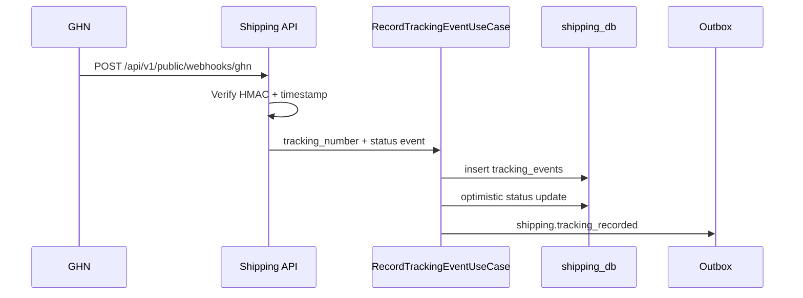

# Shipping Service Implementation Notes

Shipping consumes `order.confirmed` asynchronously instead of exposing an internal create endpoint. This keeps Order decoupled from carrier latency and lets Shipping handle duplicate events with a unique `shipments.order_id`.

Carrier integration is behind `CarrierGateway`. `mock` is the default for local tests; `ghn` uses `httpx` plus `tenacity` retries and verifies webhooks with HMAC-SHA256 over `timestamp.payload`.

PII fields are encrypted through `CryptoService` before persistence. Merchant detail responses decrypt PII; public tracking responses only return city/state/country.

